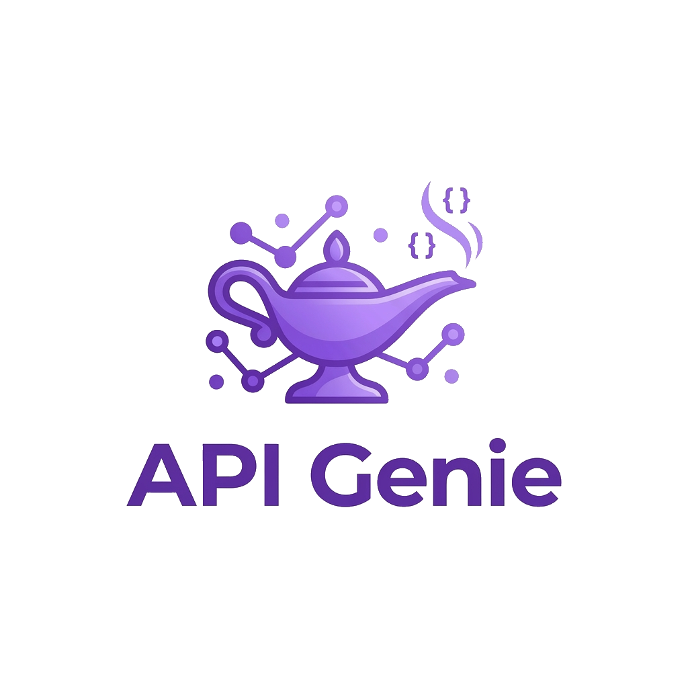

#  ApiGenie

> Self-contained mock server for **11 security platform APIs** plus **Azure Event Hubs (Kafka)** and **GCP Cloud Logging (Pub/Sub)** — built for [Observo](https://observo.ai) source-configuration testing.

ApiGenie exposes realistic, dynamically-varied data through the same authentication shapes the real platforms use (Bearer, Basic, X-ApiKeys, Duo HMAC, OAuth2 client-credentials, Microsoft tenant OAuth, GraphQL, Tenable async export, Kafka SASL/PLAIN, gRPC Pub/Sub). It runs as a single Docker Compose stack — nginx, FastAPI, Kafka + Zookeeper, Pub/Sub emulator — with Let's Encrypt TLS on `apigenie.roarinpenguin.com`.

Live at **[https://apigenie.roarinpenguin.com](https://apigenie.roarinpenguin.com)** · admin UI at **[/admin](https://apigenie.roarinpenguin.com/admin)**.

---

## Supported sources

### HTTP sources (FastAPI)

| # | Platform | Auth method | Key endpoints |
|---|----------|-------------|---------------|
| 1 | **Okta** | Bearer / SSWS | `GET /api/v1/logs` |
| 2 | **Netskope** | Bearer | `GET /api/v2/events/data/alert`, `/audit` |
| 3 | **Microsoft Entra ID** | OAuth2 (tenant-aware) | `GET /v1.0/auditLogs/directoryAudits`, `/signIns` · `POST /{tenant}/oauth2/v2.0/token` |
| 4 | **Microsoft Defender for Cloud** | Bearer | `GET /v1.0/subscriptions/{id}/providers/Microsoft.Security/alerts` |
| 5 | **Cisco Duo** | HMAC-SHA1 | `GET /admin/v1/logs/authentication`, `/admin/v2/...`, `/admin/v1/logs/administrator` |
| 6 | **Tenable VM** | X-ApiKeys (async export) | `POST /vulns/export` → `GET /vulns/export/{uuid}/status` → `GET /vulns/export/{uuid}/chunks/{n}` · `GET /audit-log/v1/events` |
| 7 | **Proofpoint TAP** | Basic Auth | `GET /v2/siem/all`, `/v2/siem/messages/blocked` |
| 8 | **Wiz** | OAuth2 + GraphQL | `POST /oauth2/token` → `POST /graphql` |
| 9 | **Snyk** | Bearer | `GET /v1/org/{id}/issues`, `/rest/orgs/{id}/issues` (JSON:API), `/projects`, `/audit` |
| 10 | **Darktrace** | HMAC-SHA1 | `GET /modelbreaches`, `/aianalyst/incident/log`, `/status`, `/groups` |

> **AWS sources (CloudTrail, WAF, GuardDuty)** are intentionally not exposed via HTTP. Real Observo collectors fetch them via SQS-notified S3 polling using the AWS SDK with hostnames hardcoded to `*.amazonaws.com` and SigV4 host-binding, which apigenie cannot intercept. The data generators remain at `sources/aws_cloudtrail.py`, `sources/aws_waf.py`, and `sources/aws_guardduty.py` for a planned LocalStack-based extension — see [`docs/LOCALSTACK_PLAN.md`](docs/LOCALSTACK_PLAN.md).

### Streaming sources

| Platform | Transport | Endpoints |
|----------|-----------|-----------|
| **Azure Platform (Event Hubs)** | Kafka SASL/PLAIN | `apigenie.roarinpenguin.com:9093` (SASL_SSL) · `:9094` (SASL_PLAINTEXT) · `:9092` (PLAINTEXT, legacy) — topic `azure-platform-logs` |
| **GCP Cloud Logging (Pub/Sub)** | gRPC | `apigenie.roarinpenguin.com:8443` (TLS, recommended) · `:8085` (plaintext, emulator-aware SDKs only) — project `obs-test`, topic `audit-logs`, subscription `audit-logs-sub` |

A background publisher pushes 5 randomly-generated events into both streams every 10 seconds.

---

## Architecture

```
                     Internet
                        │
        ┌───────────────┼─────────────────────────────┐
        │ 80/443        │ 8443             │ 9092/3/4 │ 8085
        ▼               ▼                  ▼          ▼
┌────────────────────────────────────────┐  ┌──────────────────┐
│            apigenie-nginx              │  │   apigenie-kafka │
│  Let's Encrypt TLS (HTTP + gRPC)       │  │   ZK + 4 listeners│
│  • 443  → apigenie:8000 (FastAPI)      │  │   PLAINTEXT       │
│  • 8443 → pubsub-emulator:8085 (gRPC)  │  │   SASL_SSL        │
└────────────────┬───────────────────────┘  │   SASL_PLAINTEXT  │
                 │                          │   internal        │
                 ▼                          └──────────────────┘
       ┌──────────────────┐
       │     apigenie     │     ┌──────────────────┐
       │     FastAPI      │ →   │ pubsub-emulator  │
       │  + admin UI      │     │  gRPC :8085      │
       │  + 2 publishers  │     └──────────────────┘
       └──────────────────┘
```

All containers join the `apigenie-net` Docker network. Two one-shot init services (`kafka-cert-init`, `pubsub-emulator-seed`) prepare TLS material and create the topic/subscription before the broker and emulator start serving.

---

## Deployment

### Prerequisites

- Docker + Docker Compose v2 on a host with the public DNS name `apigenie.roarinpenguin.com` resolving to it
- Let's Encrypt cert at `/etc/letsencrypt/live/apigenie.roarinpenguin.com/{fullchain,privkey}.pem` (managed by certbot on the host)
- Inbound firewall (e.g. UFW on Ubuntu) allowing the ports listed below

### Firewall

```bash
sudo ufw allow 80/tcp        # HTTP → HTTPS redirect
sudo ufw allow 443/tcp       # Main HTTPS API + admin UI
sudo ufw allow 8443/tcp      # Pub/Sub gRPC over TLS
sudo ufw allow 8085/tcp      # Pub/Sub gRPC plaintext (optional)
sudo ufw allow 9092/tcp      # Kafka PLAINTEXT (legacy)
sudo ufw allow 9093/tcp      # Kafka SASL_SSL (Event Hubs)
sudo ufw allow 9094/tcp      # Kafka SASL_PLAINTEXT
```

### Deploy

```bash
git clone https://github.com/roarinpenguin/apigenie.git
cd apigenie
docker compose up -d --build
```

That brings up the entire stack. Verify:

```bash
curl -s https://apigenie.roarinpenguin.com/health
# {"status":"ok","service":"apigenie"}

docker logs apigenie-kafka-cert-init   # cert init wrote /secrets/kafka-combined.pem
docker logs apigenie-pubsub-seed       # topic + subscription created
docker compose ps                      # all containers up
```

### Update

```bash
git pull
docker compose up -d --build
```

---

## Authentication credentials

Use these when configuring sources in Observo (or any HTTP client):

| Auth type | Header | Value |
|-----------|--------|-------|
| Bearer token | `Authorization: Bearer <token>` | `apigenie-valid-token-001` … `003` |
| Basic Auth | `Authorization: Basic <b64>` | `apigenie-principal-001` / `apigenie-secret-001` |
| X-ApiKeys (Tenable) | `X-ApiKeys` | `accessKey=apigenie-ak-001;secretKey=apigenie-sk-001` |
| Cisco Duo | HMAC-SHA1 (signature mocked) | any Authorization value accepted |
| OAuth2 client_credentials | `POST /oauth2/v1/token` | returns valid Bearer token |
| Microsoft tenant OAuth | `POST /{tenant}/oauth2/v2.0/token` | tenant id can be UUID or named |

### Error simulation

Substitute the Bearer token to trigger specific HTTP errors:

| Token | Response |
|-------|----------|
| `apigenie-error-401` | 401 Unauthorized |
| `apigenie-error-403` | 403 Forbidden |
| `apigenie-error-404` | 404 Not Found |
| `apigenie-error-429` | 429 Rate Limited |
| `apigenie-error-500` | 500 Internal Server Error |

---

## Admin UI — `/admin`

Login: `admin` / `apigenie` (override with `ADMIN_USERNAME` / `ADMIN_PASSWORD` env vars).

### Dashboard tabs

| Tab | What it shows |
|-----|---------------|
| **Sources** | One reference card per platform with copy-pasteable endpoint URLs, auth values, and an example `curl` / `kcat` command |
| **Requests** | Live trace of every inbound HTTP request, grouped by source. Includes Pub/Sub publish heartbeats (under `gcp_audit`) and Kafka produce heartbeats (under `azure_platform`) so you can confirm streaming sources are flowing even though gRPC/Kafka traffic bypasses FastAPI |
| **Container logs** | Tail logs of any container in the stack via `docker logs --follow` (apigenie, nginx, kafka, zookeeper, pubsub-emulator) |

### Useful endpoints under `/admin`

| Path | Purpose |
|------|---------|
| `/admin/login` | Login form |
| `/admin/` | Dashboard |
| `/admin/gcp-sa.json` | Generates a fresh, parseable RSA-2048 GCP service-account JSON for collectors that need a credentials file. Generated per process and held only in memory — never persisted. The `token_uri` field points back at our fake OAuth endpoint so the collector never reaches real Google. |
| `/admin/api/requests/{source}` | JSON request trace for a source (used by the dashboard) |
| `/admin/api/logs/{container}` | SSE stream of container logs |

---

## Tenable async export flow

Tenable uses a 3-step stateful export API — implemented fully in-memory with TTL eviction:

```
POST  /vulns/export                          → { "export_uuid": "..." }
GET   /vulns/export/{uuid}/status            → { "status": "FINISHED", "chunks_available": [1,2,3] }
GET   /vulns/export/{uuid}/chunks/{chunk_id} → [ { vuln }, ... ]
```

Same pattern for `/assets/export`. Exports are cached for 1 hour then auto-evicted.

`GET /audit-log/v1/events` returns Tenable platform audit events with `f=` filter and `next=` cursor support.

`GET /api/v1/refresh-access-token` returns a Bearer token for collectors that exchange X-ApiKeys for a temporary token.

---

## GCP Pub/Sub — emulator-aware vs production-shape clients

The emulator is plaintext gRPC on port `8085`. There are two ways to connect:

### Option A — emulator-aware (preferred, simplest)

The collector honours `PUBSUB_EMULATOR_HOST=apigenie.roarinpenguin.com:8085` and bypasses authentication entirely. No SA JSON, no TLS.

### Option B — production-shape (for Observo and similar collectors)

The collector treats the emulator like real GCP: TLS, SA JSON, OAuth2 JWT exchange. We support this end-to-end:

- **Pub/Sub endpoint:** `apigenie.roarinpenguin.com:8443` — nginx terminates TLS using Let's Encrypt and forwards plaintext gRPC to the emulator
- **Service account:** download from `https://apigenie.roarinpenguin.com/admin/gcp-sa.json` and upload as the GCP credentials file
- **OAuth2 token endpoint:** `https://apigenie.roarinpenguin.com/oauth2/token` (already baked into the SA JSON's `token_uri` field) — accepts any JWT assertion, returns a synthetic access token

Configure the Observo GCP source:

| Field | Value |
|-------|-------|
| Pub/Sub Endpoint | `apigenie.roarinpenguin.com:8443` |
| Project ID | `obs-test` |
| Subscription | `audit-logs-sub` |
| Credentials | upload `/admin/gcp-sa.json` |

---

## Azure Event Hubs (Kafka)

Three external listeners cover every Observo / Event Hubs configuration:

| Listener | Port | Auth | When to use |
|----------|------|------|-------------|
| `EXTERNAL` | 9092 | none | Plain Kafka clients, no SASL |
| `SASLSSL` | 9093 | SASL_SSL + PLAIN | **Real Event Hubs shape — recommended for Observo** |
| `SASLPLAIN` | 9094 | SASL_PLAINTEXT + PLAIN | Same auth as 9093, no TLS — lab override when the collector cannot validate the cert |

SASL/PLAIN credentials accepted on 9093 and 9094:

| Username | Password |
|----------|----------|
| `admin` | `apigenie-eh-admin-2026` |
| `$ConnectionString` | `Endpoint=sb://apigenie.roarinpenguin.com/;SharedAccessKeyName=mock;SharedAccessKey=apigenie-eh-mock-2026;EntityPath=azure-platform-logs` |

Configure the Observo Azure Platform source:

| Field | Value |
|-------|-------|
| Event Hubs Namespace Endpoint | `apigenie.roarinpenguin.com:9093` |
| Event Hub Name | `azure-platform-logs` |
| Consumer Group | anything (e.g. `observo-az`) |
| SASL Mechanism | `PLAIN` |
| Connection String | (the password above) |

Verify from the host:

```bash
kcat -b apigenie.roarinpenguin.com:9094 -t azure-platform-logs -C \
  -X security.protocol=SASL_PLAINTEXT -X sasl.mechanism=PLAIN \
  -X sasl.username='$ConnectionString' \
  -X sasl.password='Endpoint=sb://apigenie.roarinpenguin.com/;SharedAccessKeyName=mock;SharedAccessKey=apigenie-eh-mock-2026;EntityPath=azure-platform-logs'
```

---

## Project structure

```
apigenie/
├── app.py                    # FastAPI app: 14 source routes, OAuth2, fake Google token endpoint
├── admin.py                  # Admin UI router (/admin/*) + source reference cards + SA JSON generator
├── auth.py                   # Bearer / Basic / X-ApiKeys / Duo HMAC dependency injectors
├── trace.py                  # Request-tracing middleware → REQUEST_TRACE deque per source
├── state.py                  # Thread-safe Tenable export cache (TTL eviction)
├── generators.py             # Random-data helpers (UUID, IP, hostname, weighted choice)
├── nginx/
│   └── nginx.conf            # 443 HTTPS + 8443 gRPC TLS proxy
├── html/
│   └── index.html            # Public landing page
├── sources/                  # One module per platform (data generators)
│   ├── okta.py · netskope.py · azure_ad.py · microsoft_defender.py · cisco_duo.py
│   ├── gcp_audit.py · tenable.py · proofpoint.py
│   ├── wiz.py · snyk.py · darktrace.py
│   └── aws_cloudtrail.py · aws_waf.py · aws_guardduty.py    # generators only (no HTTP routes — see LocalStack plan)
├── publishers/
│   ├── kafka_publisher.py    # Background thread → Kafka topic azure-platform-logs
│   └── pubsub_publisher.py   # Background thread → Pub/Sub topic audit-logs
├── docker-compose.yaml       # nginx, apigenie, zookeeper, kafka-cert-init, kafka, pubsub-emulator, pubsub-emulator-seed
├── Dockerfile                # python:3.13-slim + uv + docker-cli (for admin log streaming)
├── pyproject.toml
└── assets/
    └── logo.png
```

---

## Environment variables

| Variable | Default | Description |
|----------|---------|-------------|
| `LOG_LEVEL` | `INFO` | Uvicorn / app log level |
| `PUBLISHERS_ENABLED` | `true` | Enable background Kafka + Pub/Sub publishers |
| `ADMIN_USERNAME` | `admin` | Admin UI login |
| `ADMIN_PASSWORD` | `apigenie` | Admin UI password |
| `PUBLIC_HOSTNAME` | `apigenie.roarinpenguin.com` | Used by Kafka advertised listeners and the cert-init script |
| `PUBSUB_EMULATOR_HOST` | `pubsub-emulator:8085` | Pub/Sub emulator (in-Docker) |
| `GCP_PROJECT_ID` | `obs-test` | Pub/Sub project |
| `PUBSUB_TOPIC_ID` | `audit-logs` | Pub/Sub topic |
| `PUBSUB_SUBSCRIPTION_ID` | `audit-logs-sub` | Pub/Sub subscription created by seed job |
| `PUBSUB_PUBLISH_INTERVAL` | `10` | Seconds between Pub/Sub batches |
| `PUBSUB_BATCH_SIZE` | `5` | Messages per Pub/Sub batch |
| `KAFKA_BOOTSTRAP_SERVERS` | `kafka:29092` | In-Docker Kafka listener used by the publisher |
| `KAFKA_TOPIC` | `azure-platform-logs` | Kafka topic |
| `KAFKA_PUBLISH_INTERVAL` | `10` | Seconds between Kafka batches |
| `KAFKA_BATCH_SIZE` | `5` | Messages per Kafka batch |

---

## Data realism

Each request generates fresh, randomized log entries using weighted probability templates:

- **Okta**: 70% normal logins · 10% MFA failures · 5% suspicious activity · 5% account lockouts
- **Tenable**: 40% critical Log4Shell · 35% high Apache vulns · 20% medium SMB · 5% low/informational
- **Wiz**: 40% toxic combinations · 20% critical RCE · 15% open security groups · 10% exposed secrets
- All other sources follow similar weighted distributions anchored to `now()` timestamps

---

## License

MIT
