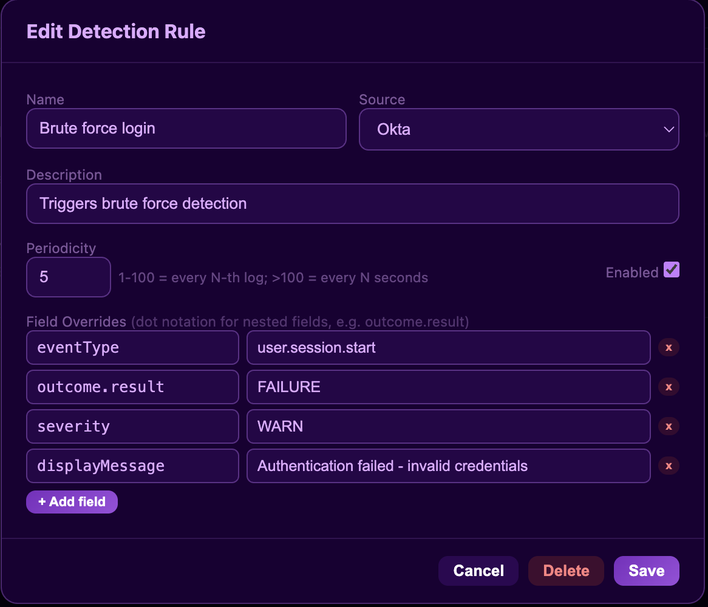
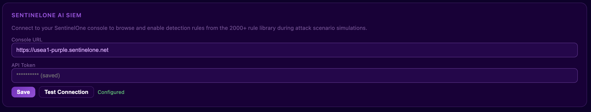
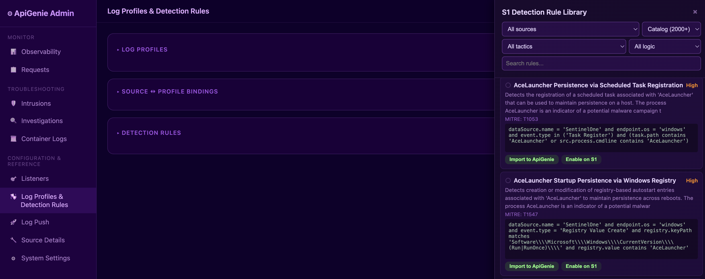
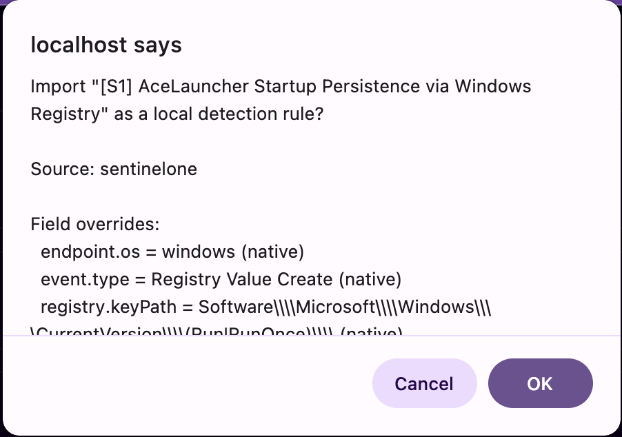

# ApiGenie — Admin Guide

> Advanced configuration: detection rules, S1 Detection Library integration, custom listeners, HEC transport details, profile tuning, and system settings.
>
> **First time as admin?** Run through the [Section 0 — Admin Lab](#0-admin-lab--operating-the-multi-user-environment) first. The exercises below are the admin counterpart to the tester scenarios in `docs/USER_GUIDE.md` Section 0 — between the two files you have an end-to-end smoke test of the entire RBAC stack.

---

## 0. Admin Lab — Operating the Multi-User Environment

This is the **administrator-side** companion to the user lab in `docs/USER_GUIDE.md` Section 0. It assumes you have already done (or are doing in parallel) the user-side exercises 1–10 so the personas `alice` and `bob` exist with identifiers and a detection rule each.

Each exercise has a **Goal**, **Steps**, and a **Pass criteria** you can check off. The point is to confirm that an administrator can correctly:

1. Carve permissions into entitlements.
2. Onboard / off-board users without SMTP.
3. Step into a user's shoes ("Viewing as") and step back out.
4. Audit isolation between users (no cross-user leakage).
5. Reason about the global vs per-user state on disk.

> The amber banner **"Viewing as alice"** is your single most important visual cue. As long as it is showing, you are looking at the platform through her permission lens. Stop and re-check it before taking any destructive action.

> **About `curl` vs the UI.** Most exercises below are point-and-click in the browser. A few want you to hit the API directly (e.g. confirming a 403 from the server, not just from CSS). The API lives at `https://<your-domain>/admin/api/*` — yes, on the same TLS port (`:443`) as the UI. There is no separate API port. Auth is by `ag_session` cookie that you obtain with `POST /admin/login` + form fields `username` and `password`. See **[§11.1 — Two distinct authentication modes](#111-two-distinct-authentication-modes--read-this-first)** for the copy-pasteable curl recipe before you attempt any API-level step.

### Exercise A — Design an entitlement matrix

**Goal.** Build three different entitlements that represent three real personas, and prove they map to three different UIs.

**Steps.**

1. **Users → Entitlements → + New Entitlement** — create:

   | Name | Sources | Log Profiles | Detection Rules | Log Push | Listeners | Investigations |
   |------|---------|--------------|-----------------|----------|-----------|----------------|
   | `SOC Analyst` | `read` | `read` | `read`,`write` | `read`,`write` | — | `read` |
   | `Pipeline Engineer` | `read` | `read`,`write` | `read` | `read`,`write` | `read`,`write` | — |
   | `Read-Only Auditor` | `read` | `read` | `read` | `read` | `read` | `read` |

2. Create three users:

   | Username | Entitlement | Password mode |
   |----------|-------------|---------------|
   | `alice` | `SOC Analyst` | handoff link |
   | `bob` | `Pipeline Engineer` | handoff link |
   | `auditor` | `Read-Only Auditor` | set inline (`audit-pw-12345`) |

3. After each user signs in (or "Viewing as" them, see Exercise C), confirm the left-nav surface is different.

**Pass criteria.**

- `alice` sees Detection Rules **with the + New Rule button** and Log Push **with start/stop**.
- `bob` sees Log Profiles **with edit pencils** but Detection Rules is **read-only** (no + New, no edit).
- `auditor` sees everything but every mutation control is hidden.
- Try **Save** on a read-only screen by hand-crafting a `POST` from `curl` with the auditor's session cookie — the API returns `403 forbidden` because the gate is **server-side** (`accounts.has_permission`), not just CSS.

---

### Exercise B — Re-issue a recovery link

**Goal.** Recover an account whose owner has lost their password or never claimed the original handoff token.

**Steps.**

1. **Users → Users** → open `alice`'s row.
2. Click **Send reset link**.
3. Copy the URL from the modal.
4. (Optional, to prove single-use) Reload the modal and **Send reset link** again. The new link **invalidates** the previous one — only the most recent unconsumed token of that kind for the user is honoured.
5. Deliver the link to Alice through any side channel; she completes `/portal/set-password`.

**Pass criteria.**

- Both links are of the form `/portal/set-password?token=…` with high-entropy tokens.
- The first (now-stale) link, when pasted, renders **"This link is invalid or has expired."**
- The most recent link works exactly once and is then dead.
- Confirm in code: `tests/test_rbac_phase3_recovery.py::TestAccountTokenLifecycle::test_consume_is_one_shot`.

---

### Exercise C — "Viewing as" — step into a user

**Goal.** Diagnose what a user can/cannot see without asking for their password.

**Steps.**

1. Top-right of the admin dashboard → user switcher (looks like a person icon next to the admin's name).
2. Pick `alice`.
3. The page reloads with a wide amber banner: **"Viewing as alice — stop viewing as"**. The avatar slot shows Alice's initials/picture.
4. Navigate through the left nav. The available pages and controls collapse to what Alice would see.
5. Click **Stop viewing as** to return to the unrestricted admin view.

**Pass criteria.**

- Mutation endpoints called while "Viewing as" succeed/fail **with Alice's permissions**, not the admin's — try creating a Listener as Alice (she lacks `listeners:write`) and confirm the API returns 403.
- The session itself is **still your admin session** — close the tab, reopen `/admin`, no second login required.
- Audit log entries (server stdout) include both the real admin username and the acting-as target (e.g. `admin (as alice)`).
- Pass criterion covered by `tests/test_rbac_phase2.py::TestSessionIdentityActingAs`.

> **Common pitfall.** Performing destructive actions while you forgot the banner is on. Always glance at the banner before deleting anything.

---

### Exercise D — Disable / re-enable an account

**Goal.** Soft-disable a user (e.g. they leave the team) without destroying their assets.

**Steps.**

1. **Users → Users** → open `bob`'s row → toggle **Account disabled** → **Save**.
2. Open Browser B (where Bob is signed in) → click anywhere — the next request returns 401 and he is bounced to `/portal/login`. New sign-in attempts now fail.
3. As admin, list `bob`'s **detection rules** and **push profiles**. They are still present, still owned by him, but cannot fire (his sessions can't drive them and his identifiers won't resolve).
4. Re-enable Bob. Sign back in — everything resumes.

**Pass criteria.**

- Disabled users cannot authenticate via username/password (`accounts.verify_login` returns `None`).
- Identifier matching still resolves credentials to a disabled user, but anything depending on a live session (Log Push start, Detection Rules edit) refuses.
- No data is destroyed by disabling — `DELETE` is a separate, more dangerous button.

---

### Exercise E — Audit identifier matching for a request

**Goal.** Confirm that a request landing on the platform is correctly attributed to its owner — the foundation of per-user behaviour.

**Steps.**

1. Have Alice register `alice-okta-personal-001` as an Okta `bearer_token` identifier (User-Lab Exercise 6).
2. From your laptop:

   ```bash
   curl -sk -H "Authorization: SSWS alice-okta-personal-001" \
     "https://<your-domain>/api/v1/logs?limit=2"
   ```

3. In the admin **Request Inspector** find the request you just made.
4. Open it — there is a **Resolved caller** row in the request detail panel. It should read `alice (usr_…)`.
5. Repeat with a token nobody owns (`bogus-token-zzz`) — the row reads **`anonymous`**.
6. Repeat with `apigenie-valid-token-001` — the row reads **`reserved (public profile)`**.

**Pass criteria.**

- The Resolved-caller field matches your expectation for every case above.
- Resolution is implemented by `accounts.match_user_by_identifier` and stamped onto the request by `auth.py`; covered in `tests/test_rbac_phase2.py::TestIdentifierMatching`.

---

### Exercise F — Prove isolation: Alice's private rule never fires for Bob

**Goal.** Negative test for the Phase 2.5 + 3 detection-rule scoping.

**Setup.** Alice has a private SentinelOne detection rule (User-Lab Exercise 8). Bob has his own SentinelOne identifier `bob-s1-token-002` but no private rules of his own.

**Steps.**

```bash
# Bob's pull — should NEVER include Alice's rule
for i in 1 2 3 4 5; do
  curl -sk -H "Authorization: ApiToken bob-s1-token-002" \
    "https://<your-domain>/web/api/v2.1/threats?limit=20" \
  | jq -c '.data[]? | select(._detection_rule == "Alice — LSASS access") | ._detection_rule'
done
```

**Pass criteria.**

- The command above produces **zero lines** of output, no matter how many times you repeat it.
- Repeating with Alice's token produces multiple `"Alice — LSASS access"` lines.
- The same isolation is enforced for Log Push profiles — see Exercise 9 in the user lab. The TDD harness for this exact property is `tests/test_rbac_phase3_log_push.py::TestPushInjectionIntegration`.

---

### Exercise G — Inspect what lives on disk

**Goal.** Build a mental model of where state is persisted so you can back it up, migrate it, or wipe it.

**Steps.**

```bash
# All RBAC + state lives under one volume on disk
docker exec apigenie ls -la /data
docker exec apigenie ls -la /data/avatars
docker exec apigenie sqlite3 /data/accounts.db ".tables"
docker exec apigenie sqlite3 /data/accounts.db \
  "select id, username, is_admin, confirmed, disabled, avatar_path from users;"
docker exec apigenie sqlite3 /data/accounts.db \
  "select id, name from entitlements;"
docker exec apigenie sqlite3 /data/accounts.db \
  "select user_id, source, id_kind, id_value from user_identifiers;"
```

**Pass criteria.**

- `accounts.db` holds: `entitlements`, `users`, `user_identifiers`, `account_tokens`.
- `detection_rules.json`, `push_profiles.json`, `source_profiles.json`, `source_intensity.json` are flat JSON files at the volume root — easy to `jq` and backup.
- Avatars are real PNGs named by user-id under `/data/avatars/`. Each one is 250 × 250 RGBA.
- Wiping `/data` resets the whole system to the bootstrap state.

> **Backup recipe.** `docker exec apigenie tar -C / -czf - data > apigenie-backup-$(date +%F).tgz`. Restore by stopping the stack, untarring into the volume, restarting.

---

### Exercise H — Capacity check via the test suite

**Goal.** Convince yourself that the RBAC guarantees you just exercised by hand are also locked in mechanically.

**Steps.**

```bash
docker exec apigenie pip install --quiet pytest pytest-asyncio
docker exec apigenie python -m pytest tests/ -v
```

**Pass criteria.**

- All tests pass (**91 at the time of writing**, post-Phase 3.5).
- The suite covers identifier registration / matching, reserved credentials guard, user-portal masking, "Viewing as" semantics, per-user detection injection (pull and push), avatar processing, recovery-token lifecycle, **self-service email / password / per-user S1 console**, and the **caller-context middleware** that scopes `/admin/api/s1/*` to the resolved user.
- If any test fails, the **first thing to check** is whether the corresponding hand-exercise above now also fails. If it does, the regression is real; if not, the test environment drifted (most likely the `/data` volume).

---

### Exercise I — Per-user S1 console overrides are unauditable by design (v5.1)

**Goal.** Understand why, since v5.1, *there is no server-side audit trail for per-user S1 console overrides* — and what an admin can still see, control, and verify.

**Why.** Until v5.0, per-user S1 settings lived in the `users` table (`console_url`, `console_token`). v5.1 removed both columns and moved the entire credential lifecycle into the operator's browser `localStorage` (User Lab Exercise 11). This is a deliberate security posture: a leaked SQLite file no longer carries any real S1 token. The trade-off is that admins **cannot inventory per-user S1 overrides server-side anymore** — the data does not exist on the server.

**Steps.**

1. **Confirm the columns are gone.** Inspect the `users` schema:

   ```bash
   docker exec apigenie sqlite3 /var/lib/apigenie/apigenie.db \
     "PRAGMA table_info(users);"
   ```

   Neither `console_url` nor `console_token` (nor `s1_console_url` / `s1_api_token`) appear. If you upgraded from v5.0 they may persist as stale columns; `accounts.py` ignores them.

2. **Confirm the v5.0 endpoints stay removed.** Run:

   ```bash
   curl -sk -c /tmp/jar -X POST \
     -d "username=admin&password=<admin-pw>" https://<your-domain>/admin/login >/dev/null

   curl -sk -b /tmp/jar -o /dev/null -w '%{http_code}\n' \
     https://<your-domain>/admin/api/me/s1-console
   # expect: 404

   curl -sk -b /tmp/jar -X PUT -o /dev/null -w '%{http_code}\n' \
     -H 'Content-Type: application/json' -d '{"console_url":"x"}' \
     https://<your-domain>/admin/api/me/s1-console
   # expect: 404 or 405
   ```

   These regressions are pinned by `tests/test_rbac_phase35_endpoints.py`.

3. **See what an admin *can* still control.** The admin-global S1 console URL + API token (used as the fallback when no `X-S1-Console-*` headers are sent) is still admin-managed under **System Settings → SentinelOne console**. Since v5.1 the token is **Fernet-encrypted at rest** in `data/s1_settings.json` (field `api_token_enc`); the key comes from `APIGENIE_SECRET_KEY` or `data/secret.key`.

4. **Verify caller-context resolution still works.** A request that carries `X-S1-Console-URL` + `X-S1-Console-Token` headers must hit *that* console for the lifetime of the request, regardless of session user. Reproduce from a script:

   ```bash
   curl -sk -b /tmp/jar \
     -H 'X-S1-Console-URL: https://alice.sentinelone.net' \
     -H 'X-S1-Console-Token: <alice-token>' \
     https://<your-domain>/admin/api/s1/test | jq
   ```

   The response source is Alice's tenant. The same call without the headers falls back to the admin-global console. Both code paths are exercised by `tests/test_rbac_phase35_endpoints.py::TestCallerContextMiddleware`.

5. **Helping a user debug "why are my rules empty?".** Walk the user through their browser:

   - DevTools → *Application* → *Local Storage* → are `apigenie.s1.console_url` and `apigenie.s1.api_token` set?
   - Network tab on any `/admin/api/s1/*` request → are the `X-S1-Console-URL` / `X-S1-Console-Token` headers present?
   - If they want to fall back to admin-global, click **Clear from this browser** on the *My SentinelOne console* card.

**Pass criteria.**

- `PRAGMA table_info(users)` shows no S1 columns are used by the code paths.
- `GET /admin/api/me/s1-console` returns 404; `PUT` / `DELETE` return 404 or 405.
- A call with the `X-S1-Console-*` headers resolves to the requested console; a call without them falls back to the admin-global token (which is Fernet-encrypted on disk).
- The admin cannot list "who has set their own S1 console" — by design. The only remaining audit surface is the admin's own `localStorage` and the per-request access log.

---

## When something looks wrong

| Symptom | Likely root cause | Where to look |
|---------|-------------------|---------------|
| Alice's avatar 404s after a rebuild | Container `/data` wasn't a named volume | `docker-compose.yaml` volumes section |
| Identifier add fails as "reserved" for a normal value | Value matches one of the demo tokens | `auth.RESERVED_CREDENTIALS` |
| Detection rule never fires for Alice | Rule's `owner_id` is null but visibility is `private` | `tests/test_rbac_phase2_5_detection.py` |
| "Viewing as" banner sticky after logout | Frontend cookie deleted but session record kept | clear `ag_session` cookie; restart the container |
| Avatar uploads return 422 | Multipart `file=` field missing — bad client | check `Content-Type: multipart/form-data` |
| `/admin/api/me/s1-console` returns 404 (v5.1+) | Endpoint intentionally removed; per-user S1 lives only in the browser `localStorage` and rides on `X-S1-Console-*` request headers | User Guide Exercise 11; pin test `tests/test_rbac_phase35_endpoints.py` |
| `/admin/api/me/password` 400 "the built-in admin must use /admin/api/change-password" | Signed in as the built-in admin (no DB row) | use System Settings → Change Password, or `POST /admin/api/change-password` |
| Admin acting-as a user calls `/me/password` and changes their *own* password instead of the target | Working as designed — that endpoint never honours acting-as | use `POST /admin/api/rbac/users/{uid}/password` or `POST /admin/api/rbac/users/{uid}/reset-link` |

---

## 1. Detection Rules

Detection rules override specific fields in normal generated logs to trigger SIEM detection rules.

### Create a detection rule

**Log Profiles & Detection Rules** → expand **▸ Detection Rules** → **+ New Rule**.

| Field               | Description                                      | Example                                                           |
| ------------------- | ------------------------------------------------ | ----------------------------------------------------------------- |
| **Name**            | Rule identifier                                  | `LSASS Access Detection`                                          |
| **Source**          | Which source's logs to inject into               | `sentinelone`                                                     |
| **Enabled**         | Toggle on/off                                    | ✓                                                                 |
| **Periodicity**     | `1 in N logs` (≤100) or `every N seconds` (>100) | `10` = 1 in every 10 logs                                         |
| **Field overrides** | Key-value pairs replacing fields                 | `event.type` = `Process Access`, `tgt.process.name` = `lsass.exe` |

> 
> 

### How injection works

When a pull source generates logs or a push source sends events, the detection rules engine checks:

1. Is the rule enabled and does the source match?
2. Has the periodicity threshold been reached?
3. If yes → override the specified fields in the next generated log

This means the log appears normal except for the overridden fields — exactly like a real malicious event mixed into normal traffic.

---

## 2. S1 Detection Library Integration

### Prerequisites

Configure S1 console access in **System Settings**:

| Setting         | Value                                                 |
| --------------- | ----------------------------------------------------- |
| **Console URL** | `https://usea1-purple.sentinelone.net` (your console) |
| **API Token**   | S1 API token with detection rule read/write scope     |

Click **Test Connection** to verify.

> 
> 

### Browse rules

**Log Profiles & Detection Rules** → **Browse S1 Library** button.

A 480px slide-out drawer opens with filters:

| Filter     | Options                                                       |
| ---------- | ------------------------------------------------------------- |
| **Source** | All sources, or pick one (Okta, SentinelOne, Palo Alto, etc.) |
| **Type**   | Catalog (2000+) or Custom rules                               |
| **Tactic** | All tactics, or a specific MITRE ATT&CK tactic                |
| **Logic**  | All logic / Visible (importable) / Hidden (browse only)       |
| **Search** | Free-text search across rule names                            |

> 
> 

### Rule card anatomy

Each rule card shows:

- **Status indicator** — ● enabled (green) / ○ disabled (grey)
- **Name** — rule title
- **Severity** — Critical (red), High (orange), Medium (yellow), Low (grey)
- **Description** — full text, no truncation
- **MITRE** — technique IDs (e.g., T1547, T1059.001)
- **Detection logic** — full s1ql query in monospace, scrollable, word-wrapped
- **Action buttons** — Import to ApiGenie / Enable on S1

### Import a rule

Click **Import to ApiGenie**. A preview dialog shows:

- Rule name (prefixed with `[S1]`)
- Auto-detected source
- Field overrides extracted from the s1ql query

Field mapping logic:

- **S1 native fields** (`endpoint.os`, `event.type`, `src.process.cmdline`, `registry.keyPath`, etc.) → passed through as-is (type: `native`)
- **`unmapped.*` fields** → prefix stripped (type: `unmapped`)
- **OCSF fields** → reverse-mapped via per-source lookup table (type: `mapped`)
- **Operators parsed**: `=`, `==`, `contains`, `ContainsCIS`, `matches`, `startswith`, `endswith`, `in (...)`

Click **OK** to create the local detection rule with pre-populated field overrides.

> 
> 

### Enable/disable rules on S1

Click **Enable on S1** or **Disable on S1** to toggle a rule's status directly on your SentinelOne console via API. This requires a token with write scope.

### Logic visibility

- **Visible** rules have s1ql queries exposed in the API response → importable
- **Hidden** rules have no query content (typically "First Seen" behavioral rules) → browse-only
- When selecting the "Visible" filter, the type auto-switches to match

---

## 3. Log Push — Advanced Configuration

### HEC flavour details

| Flavour              | Auth header                         | Extra headers            | Endpoint path                                            |
| -------------------- | ----------------------------------- | ------------------------ | -------------------------------------------------------- |
| **Splunk HEC**       | `Authorization: Splunk <token>`     | —                        | `/services/collector/event` or `/services/collector/raw` |
| **S1 AI SIEM**       | `Authorization: Bearer <api-token>` | `S1-Scope: account=<id>` | `/services/collector/raw`                                |
| **Observo / S1 DPM** | `Authorization: Bearer <jwt>`       | —                        | `/services/collector/raw`                                |

Auto-detection:

- If the host contains `sentinelone.net` and the path is HEC-like → S1 AI SIEM
- If the stored profile has `hec_flavour: observo` → Observo (uses HTTP/2 via `http.client`)
- Otherwise → Splunk HEC

### Syslog configuration

| Parameter     | Description              |
| ------------- | ------------------------ |
| **Protocol**  | TCP or UDP               |
| **Host:Port** | Syslog server address    |
| **Facility**  | 0–23 (default: 1 = user) |
| **Format**    | RFC 5424                 |

### HTTP POST configuration

| Parameter   | Description                  |
| ----------- | ---------------------------- |
| **URL**     | Full destination URL         |
| **Headers** | Custom headers (JSON object) |
| **TLS**     | Enable/disable               |

---

## 4. Log Profiles — Advanced

### Signal-to-noise ratio

Controls how often profile entities appear in generated logs:

- **100%** — every log uses profile entities
- **50%** — half use profile entities, half use random
- **10%** — rare profile entities, mostly random

### Log volume scaling

Controls the number of events returned per API call:

- **100%** — full output (e.g., 50 events per request)
- **25%** — quarter output (12–13 events per request)
- Useful for simulating low-traffic sources

### Entity types

| Entity           | Fields                                     | Used by                       |
| ---------------- | ------------------------------------------ | ----------------------------- |
| **Users**        | username, domain, email, department, title | All sources with user context |
| **Machines**     | hostname, IP, OS, workstation name         | EDR, network sources          |
| **C2 servers**   | FQDN, IP, port, protocol                   | Threat-related sources        |
| **Malware**      | filename, family, hash, cmdline            | EDR, threat sources           |
| **Mail senders** | from, to, subject, attachment              | Email security sources        |

---

## 5. Custom Listeners

Create custom HTTP endpoints that accept any payload.

**Listeners** tab → **+ New Listener**.

| Field               | Description                           |
| ------------------- | ------------------------------------- |
| **ID**              | URL path segment (e.g., `my-webhook`) |
| **Auth**            | None, Bearer, Basic, API key          |
| **Response status** | HTTP status code to return            |
| **Response body**   | Static JSON response                  |
| **Chaos mode**      | Random failures at configurable rate  |
| **Rate limit**      | Max requests per minute               |

Access at: `https://<domain>/listener/<id>/<any-path>`

Each listener has its own request log in the admin UI.

---

## 6. Intrusion Detection

The **Intrusions** tab aggregates suspicious patterns detected in incoming requests — SQL injection, XSS, path traversal, etc. Useful for testing WAF rule effectiveness.

---

## 7. Investigations

The **Investigations** tab provides a guided triage workflow for exploring generated events across sources.

---

## 8. Container Logs

The **Container Logs** tab streams live logs from all Docker containers (apigenie, nginx, kafka, zookeeper, pubsub) in the admin UI.

---

## 9. System Settings

| Setting             | Description                               |
| ------------------- | ----------------------------------------- |
| **S1 Console URL**  | SentinelOne management console URL        |
| **S1 API Token**    | Token for Detection Library API access    |
| **Test Connection** | Verifies API connectivity and permissions |

---

## 10. Data Persistence

All configuration is stored as JSON files in `$APIGENIE_DATA_ROOT` (default: `/data/` inside the container, mounted as a Docker volume).

| File                   | Contents                     |
| ---------------------- | ---------------------------- |
| `detection_rules.json` | Local detection rules        |
| `push_profiles.json`   | Log push configurations      |
| `profiles.json`        | Log profiles (entity pools)  |
| `bindings.json`        | Source ↔ profile assignments |
| `s1_settings.json`     | S1 console URL + token       |
| `listeners.json`       | Custom listener configs      |

---

## 11. API Reference — Admin Endpoints

### 11.1 Two distinct authentication modes — read this first

ApiGenie speaks two completely different "APIs" on the same TLS port (`:443`, terminated by nginx and proxied to the FastAPI app on the internal port `8000`). They use **different credentials**, and confusing them is the most common source of "but why does my request 401?" tickets.

| API surface | Examples | Auth credential | How you obtain it |
|-------------|----------|-----------------|-------------------|
| **Source-data endpoints** (the whole point of apigenie — generate logs for a pipeline) | `/api/v1/logs` (Okta), `/web/api/v2.1/threats` (SentinelOne), `/siem/v1/events/cg` (Mimecast), `/v1.0/auditLogs/directoryAudits` (Entra), … | The header that vendor expects: `Authorization: SSWS …`, `Authorization: ApiToken …`, `Authorization: Bearer …`, `X-ApiKeys: …`, HTTP Basic, etc. | Pre-seeded **demo tokens** (`apigenie-valid-token-001`, `apigenie-ak-001`/`apigenie-sk-001`, `apigenie-principal-001`/`apigenie-secret-001`) or **your own per-user identifier** registered through the user portal (User-Lab Exercise 6). |
| **Admin / Portal control-plane** (everything under `/admin/api/*` and `/portal/api/*`) | `/admin/api/me`, `/admin/api/rbac/users`, `/admin/api/detection-rules`, `/admin/api/users/me/avatar`, … | The `ag_session` HTTP cookie. `HttpOnly`, `SameSite=Lax`, 24-hour TTL. | `POST /admin/login` or `POST /portal/login` with form-encoded `username` + `password`. |

**Everything is reachable on `https://<your-domain>/` (port 443).** No service exposes a separate API port — nginx fronts the whole thing. The internal port 8000 is **never** published.

#### Yes, you can drive `/admin/api/*` from curl

Three steps: log in, capture the cookie, reuse it.

```bash
# 1. Log in. Successful login returns 303 + Set-Cookie: ag_session=...
curl -sk -c /tmp/apigenie.cookies \
     -X POST "https://<your-domain>/admin/login" \
     -d "username=admin" \
     -d "password=<your-admin-password>" \
     -o /dev/null -w "HTTP %{http_code}\n"
# HTTP 303      ← good; 401 means bad credentials

# 2. Confirm who you are
curl -sk -b /tmp/apigenie.cookies \
     "https://<your-domain>/admin/api/me" | jq .
# {
#   "username": "admin",
#   "role": "admin",
#   "is_admin": true,
#   "permissions": { … },
#   "has_avatar": false
# }

# 3. Hit any admin endpoint with the same cookie jar
curl -sk -b /tmp/apigenie.cookies \
     "https://<your-domain>/admin/api/rbac/users" | jq '.[] | .username'

# 4. Log out cleanly (kills the server-side session record)
curl -sk -b /tmp/apigenie.cookies "https://<your-domain>/admin/logout" -o /dev/null
```

The same pattern works for a regular user — just replace `/admin/login` with `/portal/login` and use Alice's credentials. The cookie they get back unlocks the user-scoped subset of the API.

> **Don't ship the cookie around.** `ag_session` is the only thing that proves "I am this admin" to the API. Treat the cookie jar file like a password file: chmod 600, never commit, delete when done. The cookie is `HttpOnly` so browser JS cannot read it, but anything that has shell access to your laptop can.

#### Identifier vs session — which one for which call?

A request to **`/api/v1/logs`** (Okta) does **not** need a session cookie. It needs the `SSWS <token>` header. The token itself decides the persona:

| Token value | Effect |
|-------------|--------|
| `apigenie-valid-token-001` (or any other reserved demo token) | "public" persona — sees the public profile binding, public detection rules, no identifier match |
| Alice's registered token (e.g. `alice-okta-personal-001`) | "alice" persona — sees her bindings, her private detection rules |
| Any other unmatched value | "anonymous" — falls back to the public profile |

In other words, **the source token authenticates the caller for log-shaping purposes; the session cookie authenticates the operator for control-plane purposes**. They never overlap.

#### Session error reference

| Symptom | Meaning | Fix |
|---------|---------|-----|
| `{"error":"unauthorized"}` 401 from `/admin/api/*` | No cookie sent, or cookie is unknown to the server (restart wiped sessions) | Re-run `POST /admin/login` |
| 401 immediately after a successful login | You forgot `-b /tmp/apigenie.cookies` on the next curl, or you stripped cookies in your client | Always pass the cookie jar |
| 401 after exactly 24 hours of inactivity | TTL expired (`SESSION_TTL = 86400`) | Re-login |
| 303 with `Location: /admin/login` on a browser hit | The page detected a missing/expired cookie and is bouncing you to the login form | Sign in again |

---

### 11.2 Endpoint catalogue

All endpoints below require a valid `ag_session` cookie (obtained as shown above) **plus** the appropriate RBAC permission. Admin-role sessions implicitly have every permission; user-role sessions are filtered by their entitlement.

### Detection Rules

```
GET    /admin/api/detection-rules          — list all rules
POST   /admin/api/detection-rules          — create rule
PUT    /admin/api/detection-rules/{id}     — update rule
DELETE /admin/api/detection-rules/{id}     — delete rule
```

### S1 Integration

```
GET    /admin/api/s1/settings              — get GLOBAL S1 console settings
POST   /admin/api/s1/settings              — save GLOBAL S1 console settings
POST   /admin/api/s1/test                  — test S1 connection (uses resolved settings)
GET    /admin/api/s1/rules                 — query S1 catalog rules
GET    /admin/api/s1/custom-rules          — query S1 custom rules
GET    /admin/api/s1/rules/{id}/import-preview — preview import mapping
POST   /admin/api/s1/rules/import          — import rule as local
PUT    /admin/api/s1/rules/{id}/enable     — enable rule on S1
PUT    /admin/api/s1/rules/{id}/disable    — disable rule on S1
```

> **Per-user override (v5.1).** Every `/admin/api/s1/*` request is automatically routed through the caller's *personal* S1 console + token **only if the browser sent the request headers `X-S1-Console-URL` and `X-S1-Console-Token`**. The headers are populated by the admin shell's global `fetch` wrapper from the user's `localStorage` (see User Guide Exercise 11). Resolution order is implemented in `s1_detection_library._resolved_settings()`:
> 1. If the request carries non-empty `X-S1-Console-URL` and `X-S1-Console-Token` headers (read into a `ContextVar` by the middleware in `app.py`), those win.
> 2. Otherwise, fall back to the admin-global settings written via `POST /admin/api/s1/settings`. The token persists in `data/s1_settings.json` as `api_token_enc`, Fernet-encrypted with the key from `APIGENIE_SECRET_KEY` or `data/secret.key`.
>
> Because the per-user override travels with the *browser* and not the *session*, an admin acting-as a user **does not** automatically execute S1 calls against the target user's tenant — the admin's own browser `localStorage` always wins. There is no server-side cross-user S1 sharing by design.

### Self-service account (Phase 3.5, updated for v5.1)

Every registered user can edit their own email and password through the user portal. The per-user SentinelOne console URL + API token moved out of the server entirely in v5.1: they live only in the operator's browser `localStorage` (see User Guide Exercise 11) and ride on every request as the headers `X-S1-Console-URL` / `X-S1-Console-Token`. The built-in admin (no DB row) gets `is_builtin_admin: true` from `GET /me/account` and is steered to System Settings + `/admin/api/change-password` instead.

```
GET    /admin/api/me/account               — { username, email, is_builtin_admin }
PUT    /admin/api/me/email                 — { "email": "you@example.com" }
PUT    /admin/api/me/password               — { "current": "...", "new": "..." }  (min 8 chars; verifies current)
```

The v5.0-era `GET/PUT/DELETE /admin/api/me/s1-console` endpoints are **removed**; calls return `404`/`405`. The regression is pinned by `tests/test_rbac_phase35_endpoints.py`.

**Semantics that matter for admins:**

- `/me/email` honours the **acting-as** target — when you flip the user-switcher to Alice, that endpoint mutates **Alice's** row. (Useful for emergency reconfig.)
- `/me/password` does **not** honour acting-as. It always mutates the *real* signed-in account so an admin cannot silently rewrite a user's password through the self-service path. To reset another user's password as admin, use the dedicated `POST /admin/api/rbac/users/{uid}/password` (no current-password challenge) or generate a one-shot recovery link via `POST /admin/api/rbac/users/{uid}/reset-link`.
- **Per-user S1 console is browser-resident only.** Admins can no longer audit who has configured an override server-side (Exercise I in this guide). The trade-off is a much smaller blast radius for SQLite leaks.

### Profiles & Push

```
GET    /admin/api/profiles                 — list profiles
POST   /admin/api/profiles                 — create profile
PUT    /admin/api/profiles/{id}            — update profile
DELETE /admin/api/profiles/{id}            — delete profile
GET    /admin/api/bindings                 — list source bindings
POST   /admin/api/bindings                 — save binding
GET    /admin/api/push-profiles            — list push profiles
POST   /admin/api/push-profiles            — create push profile
POST   /admin/api/push/{id}/start          — start pushing
POST   /admin/api/push/{id}/stop           — stop pushing
```
