

# Say hello to API Genie!

### A use-case guide to generating realistic security telemetry

**Version 5.1** · Updated June 12th, 2026

---

# Intro

API Genie is a simulation platform conceived to empower any activity that needs **realistic and plausible security telemetry**, generated in a variety of ways — pulled by your collectors, pushed to your pipelines, streamed over brokers, fired as webhooks, or orchestrated as full multi-stage attack campaigns.

The solution is hosted online at [https://apigenie-poc.roarinpenguin.com](https://apigenie-poc.roarinpenguin.com), and is available as an open-source project to build your own lab at [https://github.com/roarinpenguin/apigenie](https://github.com/roarinpenguin/apigenie).

This guide describes the functionality of the platform **from the standpoint of the people who use it**. It is organized around use cases and split into four parts:

- **Part I — Step by step use cases** comes first, for readers in a hurry: task-oriented, end-to-end walkthroughs that string features together to reach a concrete goal ("as a user, I want to…").
- **Part II — Using API Genie** is the feature reference for the **end user** who works in the user portal at `/portal` to generate telemetry and drive their pipelines.
- **Part III — Administering API Genie** is the feature reference for the **administrator** who works in the admin console at `/admin` to observe, troubleshoot, govern access, secure secrets, and keep the platform healthy.
- **Part IV — Have Data Pipelines? Onboard 12 sources in 10 minutes!** is the companion walkthrough for wiring SentinelOne Data Pipeline Integrations to API Genie's sources.

Need a recipe? Start with Part I. Want to understand *what a feature does*? Reach for Parts II and III. Choose the part — and the section — that matches what you are trying to do.

> **A note on URLs.** Throughout this guide the platform is reached at **`https://apigenie-poc.roarinpenguin.com`**. Every screenshot in this book was captured against the live service at that address. If you are running your own lab from the open-source project, substitute your own domain wherever you see it.

---

## What's in this guide

**Part I — Step by step use cases** · *start here if you're in a hurry*

- [P1 · User — Set up your profile, onboard three sources, and define a log push](#p1-user-set-up-your-profile-onboard-three-sources-and-define-a-log-push)
- [P2 · User — Customize log profiles and import detection rules from SentinelOne](#p2-user-customize-log-profiles-and-import-detection-rules-from-sentinelone)
- [P3 · User — Create an attack scenario with your own characters and devices](#p3-user-create-an-attack-scenario-with-your-own-characters-and-devices)
- [P4 · Admin — Provision default profiles and users](#p4-admin-provision-default-profiles-and-users)

**Part II — Using API Genie** · *feature reference, the user portal*

1. [Get access to the platform and configure your user profile](#1-get-access-to-the-platform-and-configure-your-user-profile)
2. [Generate telemetry with API-based Log Pull — common sources](#2-generate-telemetry-with-api-based-log-pull-common-sources)
3. [Generate telemetry with API-based Log Pull — custom listeners](#3-generate-telemetry-with-api-based-log-pull-custom-listeners)
4. [Generate telemetry with Log Push](#4-generate-telemetry-with-log-push)
5. [Generate Webhook calls](#5-generate-webhook-calls)
6. [Generate Attack Scenarios](#6-generate-attack-scenarios)
7. [Customize your telemetry with Log Profiles and Detection Rules](#7-customize-your-telemetry-with-log-profiles-and-detection-rules)
8. [Generate alerts for the SentinelOne Singularity platform](#8-generate-alerts-for-the-sentinelone-singularity-platform)

**Part III — Administering API Genie** · *feature reference, the admin console*

- [A. Admin access and the console](#a-admin-access-and-the-console)
- [B. Observability](#b-observability)
- [C. Troubleshooting](#c-troubleshooting)
- [D. RBAC — entitlements, users, and access](#d-rbac-entitlements-users-and-access)
- [E. Security — Intrusions, Investigations, and Ban](#e-security-intrusions-investigations-and-ban)
- [F. Storage, secrets, and data protection](#f-storage-secrets-and-data-protection)

**Part IV — Have Data Pipelines? Onboard 12 sources in 10 minutes!**

- [Onboard 12 sources into SentinelOne Data Pipeline](#part-iv-have-data-pipelines-onboard-12-sources-in-10-minutes)

---

# Part I — Step by step use cases

**In a hurry? Start here.** This part is the cookbook — each entry is a goal stated as a use case, followed by the exact sequence of steps. Parts II and III explain what each feature does in depth; the procedures below cross-reference those sections by number (e.g. §1.2, §7, §D) whenever you want more detail. Everything uses the production host `https://apigenie-poc.roarinpenguin.com`.

---

## P1 · User — Set up your profile, onboard three sources, and define a log push

> **Goal.** As a user, I want to set up my profile with my own tokens, onboard three pull sources — **Okta, Netskope, Proofpoint** — and define a **Log Push for a Palo Alto firewall**.

**Prerequisites:** your account exists and you've claimed your set-password link (§1.1).

**Steps**

1. **Sign in** to the portal (§1.2).

   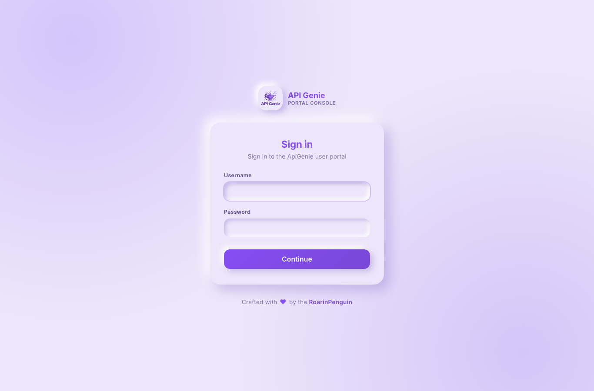

2. **(Optional) Point API Genie at your own SentinelOne tenant.** Sidebar → **👤 My Account** → **My SentinelOne console**: enter your tenant **URL** and **API token**, then **Save S1 console**. Remember these are held **only in this browser** and sent as request headers — the server never stores them (§1.4). You'll need this for P2's rule import.

   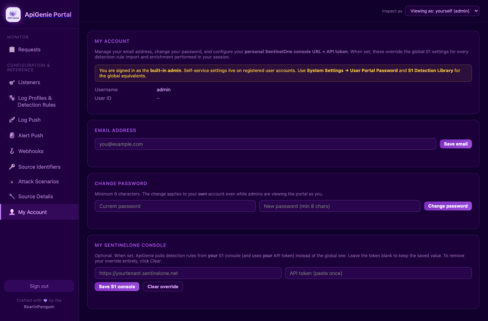

3. **Register a source identifier for each of the three sources.** Sidebar → **🔑 Source Identifiers**. For each source, choose it in the **source** dropdown, pick the credential **kind**, type the exact value your collector will present, and click **+ Register**:

   | Source | What your collector sends | Register as |
   |---|---|---|
   | **Okta** | `Authorization: SSWS <token>` | a **bearer token** identifier = your token value |
   | **Netskope** | `Netskope-Api-Token` / `Authorization: Bearer <token>` | a **bearer token** identifier = your token value |
   | **Proofpoint TAP** | HTTP Basic (`principal` : `secret`) | a **basic user** identifier = your service-principal value |

   Each value is globally unique, and the built-in shared demo tokens are reserved — use values of your own (e.g. `myteam-okta-001`).

   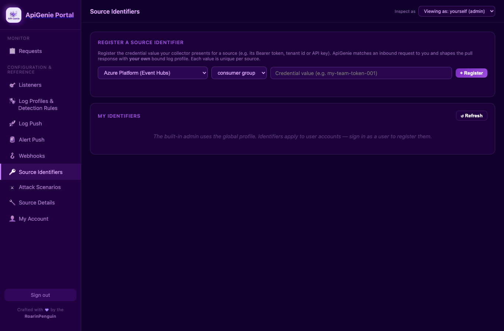

4. **Wire your collectors.** Open the **🔧 Source Details** tab and copy the exact endpoint path, auth header, and `curl` example for each of the three sources. Point your Okta/Netskope/Proofpoint collectors at those endpoints, presenting the credentials you registered in step 3. (Endpoint/auth shapes are summarized in §2.3.)

5. **Confirm the pulls land.** Open **📋 Requests**, click the **Okta** (then **Netskope**, **Proofpoint**) source chip, and watch the recent calls appear with status `200` — proof your identifier matched and the response was shaped for you.

   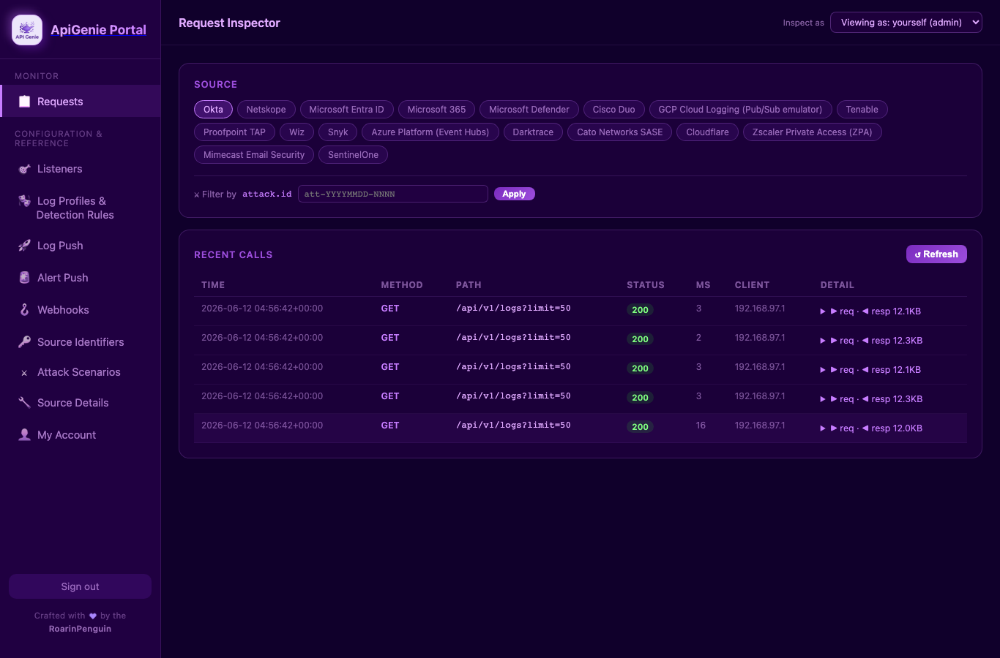

6. **Define the Palo Alto log push.** Sidebar → **🚀 Log Push** → **+ New Push Profile**:
   - **Name:** e.g. `PAN → my SIEM`.
   - **Source Type:** **Palo Alto Firewall (PAN-OS)**.
   - **Format:** **CEF** or **Syslog (RFC5424)** for a syslog target, or **JSON** for HTTP/HEC.
   - **Transport / Destination:** **Syslog TCP** to your collector's host + port `514` (or **HEC** → your S1 DPM/Observo ingest), set **TLS** if required.
   - **Rate & Duration:** e.g. `10` eps for `1 hour`.
   - **(Optional) Log Profile:** bind one (see P2) so the firewall events feature your own entities.
   - **Save**, then **Start**. Click **Events** on the card to watch deliveries stream out (§4.2).

   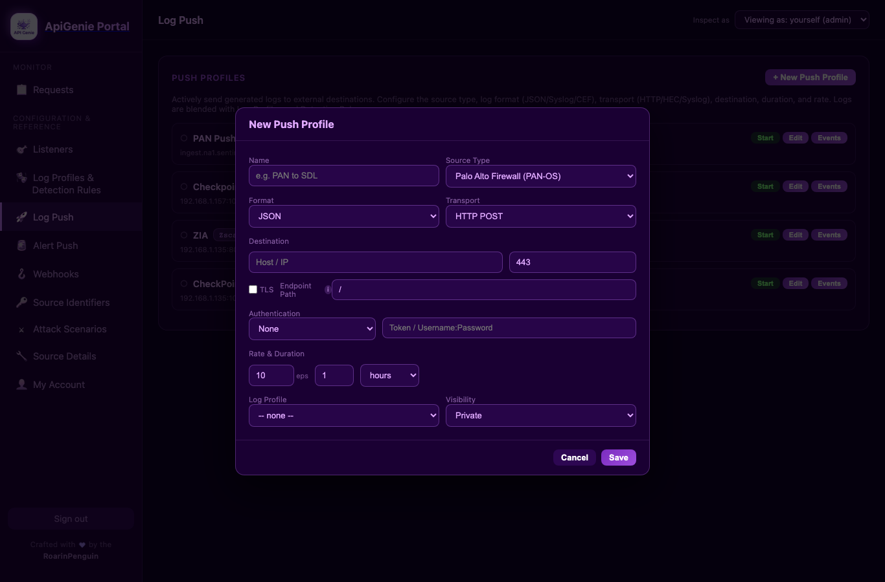

You now have three sources answering your collectors with per-user telemetry, and a Palo Alto stream pushing to your destination.

---

## P2 · User — Customize log profiles and import detection rules from SentinelOne

> **Goal.** As a user, I want to customize my log profiles with my own users, devices, etc., and set up detection rules **pulled from SentinelOne**.

**Prerequisites:** you completed P1 step 2 (your personal S1 console is set), so the rule import queries *your* tenant.

**Steps**

1. **Open** sidebar → **🎭 Log Profiles & Detection Rules**.

   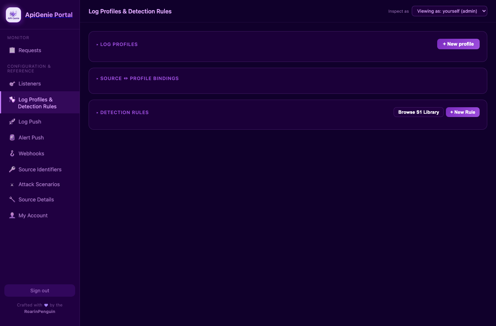

2. **Create your profile.** Click **+ New profile**, give it a name, and populate the entity pools — **Users** (name, email, department, workstation, IPs…), **Machines**, **C2 Servers**, **Malware**, **Mail Senders**. Anything you leave short is auto-filled to the pool cap, and the per-profile **seed** keeps runs reproducible (§7.1). Save.

   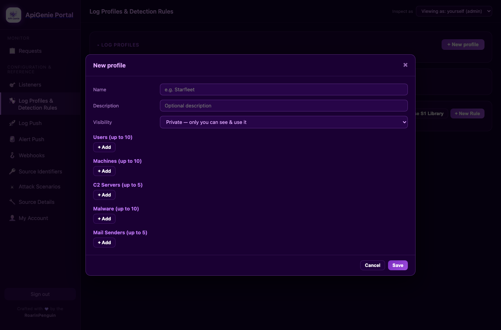

3. **Bind the profile to your sources.** On the **Source ↔ Profile Bindings** card, bind your profile to the sources you onboarded in P1, and set the **Ratio** (how much of the telemetry uses your entities) and **Log volume / intensity** (§7.1). Now the same `alice@…` / `ferrix-ws` appears correlatably across Okta, Netskope, Proofpoint, and your Palo Alto push.

4. **Import detection rules from SentinelOne.** Click **Browse S1 Library**. API Genie queries *your* S1 console (the browser-side creds from P1 step 2) and lists the platform's detection rules; filter by data source, MITRE tactic, or severity, then import the ones you want. Each imported rule becomes a **local Detection Rule** owned by you, with its S1 query fields mapped back to the originating vendor's field names — so the events API Genie injects look exactly like what the real S1 rule hunts for (§7.2).

5. **Tune or add rules by hand.** Use **+ New Rule** to create or adjust a rule — set the **Source**, **Field overrides** (dot-notation), **Periodicity** (1–100 = one per *N* logs; >100 = one every *N* seconds), and **Enabled** (§7.2).

   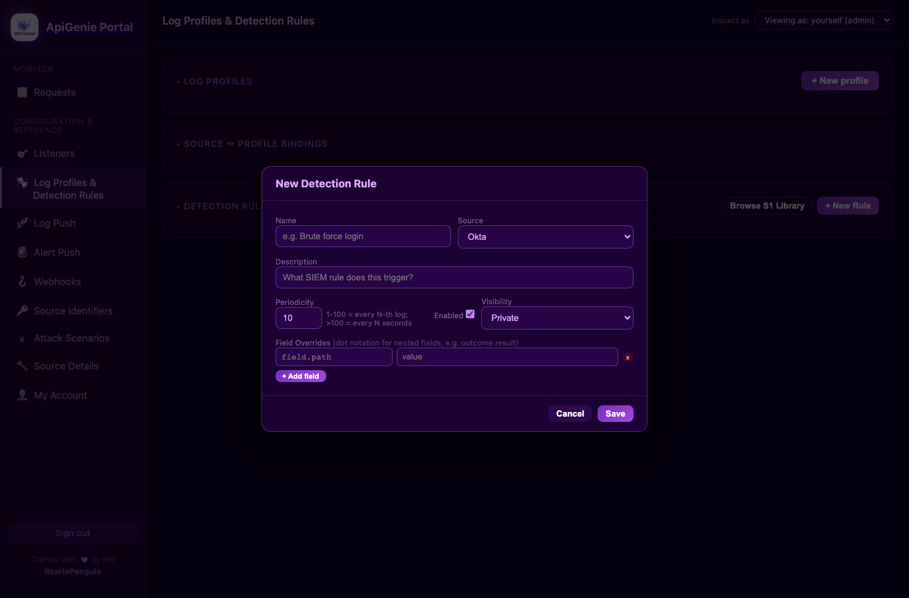

6. **Verify.** Pull one of your bound sources (or run the Palo Alto push) and confirm the injected detections appear — each carries a `_detection_rule` marker so you can spot them in your SIEM/XDR.

---

## P3 · User — Create an attack scenario with your own characters and devices

> **Goal.** As a user, I want to run a multi-phase attack scenario whose events feature **my own users ("characters") and machines ("devices")** — not random ones — so the kill chain reads like *my* environment under attack.

**Prerequisites:** you've built a Log Profile with your own entities (P2).

**Steps**

1. **Cast your characters and devices.** In **🎭 Log Profiles & Detection Rules**, populate your profile's **Users** (your "characters") and **Machines** (your "devices") — plus **C2 Servers** / **Malware** if the scenario should reference them (§7.1).

   

2. **Bind the profile to the scenario's sources, at a high ratio.** On the **Source ↔ Profile Bindings** card, bind that profile to the sources the scenario will touch and push the **Ratio** up so most events draw from your pool (§7.1). Attack phases inject events into these same source generators, so they inherit your bound entities — that is what makes the attack feature *your* people and hosts.

3. **Start from the Business Email Compromise template.** Open **⚔ Attack Scenarios** → **+ New Scenario** and pick **Business Email Compromise (BEC)** from *Start from template*. It auto-fills a five-phase kill chain — phishing email → credential theft → mailbox access → inbox rule → exfiltration — each phase wired to the source it needs (the source is shown on every phase row). Give it a **Name** and **Duration**.

   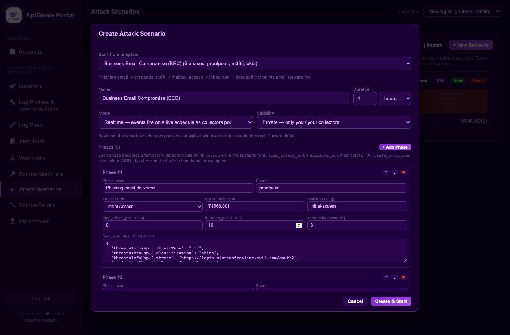

4. **Set Visibility (and how the timing works).** Scenarios run **live**: phases activate over wall-clock and events fire as collectors poll inside each phase window — the attack unfolds as your audience watches, and timestamps are backdated across the configured duration so the campaign reads correctly on the timeline. The **Visibility** selector decides *who* sees it: **Private** *(default)* keeps the run scoped to your own collector token; **Public** lets every caller on the instance see it.

   > **Note:** an earlier *Historical* mode (pre-stage the whole attack already in the past) was removed in v5.2.0 — SentinelOne AI-SIEM detections fire when telemetry is *ingested*, so the resulting alerts always landed at "now" regardless of the backdated event times. Realtime is now the only mode.

5. **Check which collectors the scenario needs.** Every card has a **Setup notes ▾** disclosure that auto-lists, for each source the scenario touches, the collector you must point at API Genie for the story to land. For **BEC** that means **Proofpoint**, **Okta**, and **Microsoft 365** — configure those three collectors (see §2 and Part IV) with the source identifiers you registered, and the scenario plays out end-to-end.

6. **Create & Start.** The MITRE kill-chain timeline lights up and a fresh `attack.id` is minted; the active phase glows (§6.2).

   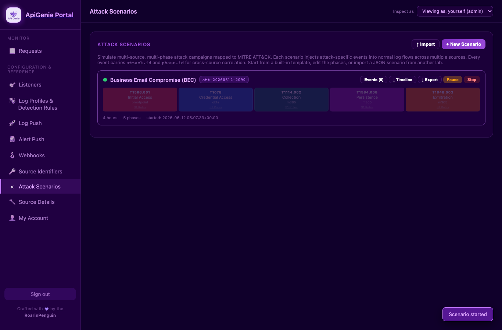

7. **Watch your characters in the story.** Click **Events** on the card — the streaming per-phase log shows attack telemetry carrying *your* users and devices.

   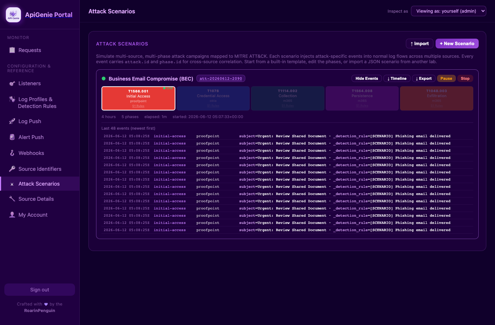

8. **Correlate.** Copy the card's `attack.id` into the Request Inspector's **⚔ Filter by attack.id** box to pull every inbound call that delivered a tagged event (§6.3) — pull sources surface here, while push-source phases live in the Events panel.

   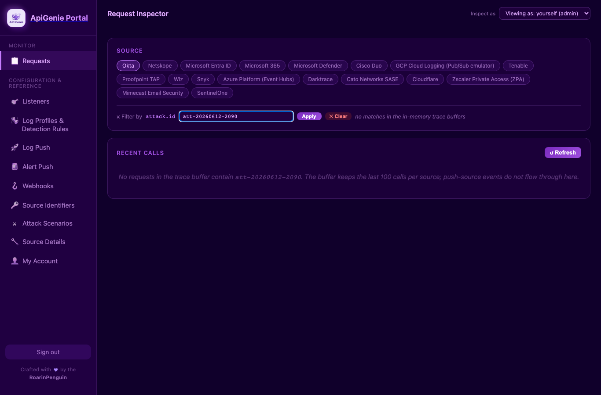

---

## P4 · Admin — Provision default profiles and users

> **Goal.** As an admin, I want to provision some **default profiles** and **users** so a new team can start immediately.

**Steps**

1. **Sign in** to the admin console at `https://apigenie-poc.roarinpenguin.com/admin` (§A).

2. **Create the default profiles.** Open **🎭 Log Profiles & Detection Rules**, click **+ New profile**, build a sensible shared profile (and any starter detection rules), and set **Visibility = Public**. Public objects are visible to every user as **view/clone** — they become each team member's starting point without exposing anything private (§7.3). Repeat for any shared **Log Push** / **Alert Push** / **Webhook** templates you want to seed (mark them Public too).

3. **Create an entitlement.** Go to **⚙ System Settings → Entitlements → + New entitlement**. Tick the permission levels (**View / Create / Modify / Delete / Operate**) per category (Log Profiles, Detection Rules, Log Push, Custom Listeners, Source Bindings, …) to define what this class of user may do (§D.1).

   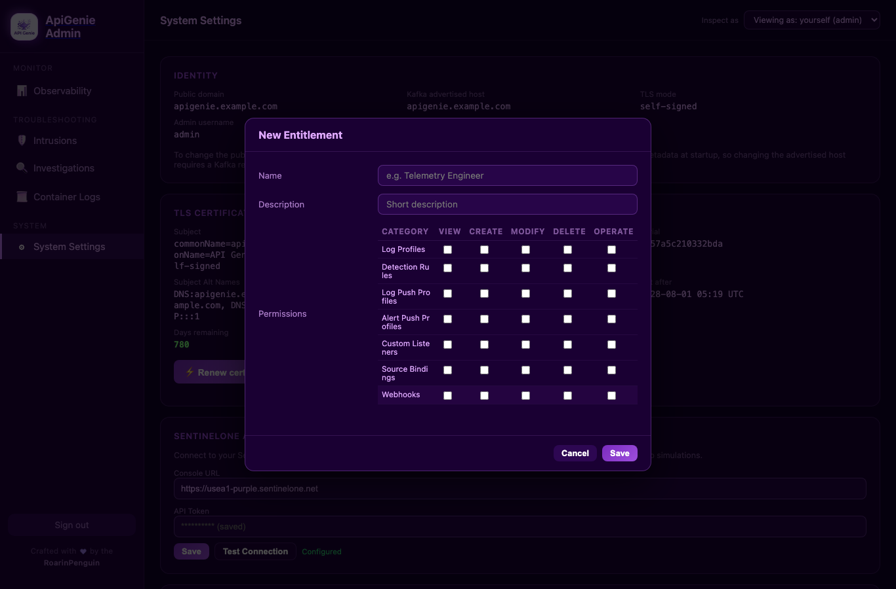

4. **Create the users.** **System Settings → User Accounts → + New user**. For each person, set a **Username**, optional email, and the **Entitlement** from step 3. **Leave the password blank** to mint a one-time **setup link** (`/portal/set-password?token=…`); hand that link to the user out-of-band — no email server required (§D.2).

   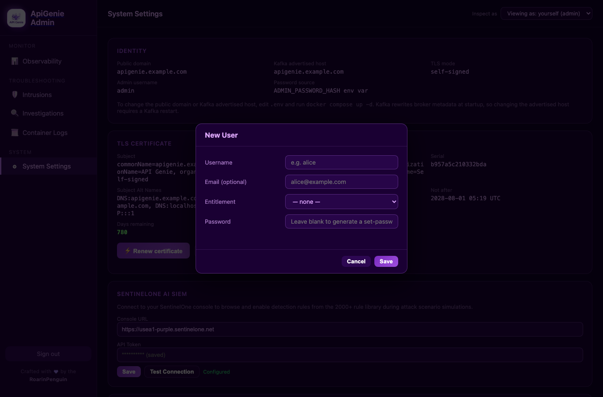

5. **Verify what a new user sees.** Sign into `/portal`, use the **"Viewing as"** switcher to impersonate one of the new users, and confirm they see the public default profiles and exactly the actions their entitlement grants (§D.3). Click **Stop** to return to your own view.

Your team can now claim their links, set passwords, and land on a portal pre-stocked with shared defaults and scoped to the right permissions.

---

# Part II — Using API Genie

Everything in Part II happens in the **user portal** at `https://apigenie-poc.roarinpenguin.com/portal`. You sign in once, and the left-hand sidebar gives you everything you can do: inspect inbound requests, stand up listeners, shape profiles and detection rules, push logs and alerts, fire webhooks, and run attack scenarios.

---

## 1 · Get access to the platform and configure your user profile

API Genie is multi-tenant. One deployment hosts many isolated users, and each user gets their own private corner of the platform: their own log profiles, detection rules, source identifiers, SentinelOne console, avatar, and account settings. This section walks you through getting in and setting yourself up.

### 1.1 Getting access — the no-email setup-link handoff

API Genie has **no mail server**, so you will never receive a "welcome" or "reset your password" email. Onboarding is deliberately out-of-band:

1. **Your administrator creates your account** with a username (e.g. `alice`), an optional cosmetic email, and an **entitlement** that decides what you are allowed to do (see §1.6).
2. **They leave your password blank.** That blank password is the trigger: instead of setting a password for you, API Genie mints a single one-time **set-password link** of the form
   `https://apigenie-poc.roarinpenguin.com/portal/set-password?token=<long-random-token>`.
3. **The admin hands you that link directly** — chat, ticket, call, sticky note. You open it, choose a password (minimum 8 characters), confirm it, and you're in. The token is single-use and expires after 7 days; if it lapses, the admin simply issues a fresh one. The same mechanism doubles as password recovery later.

### 1.2 Signing in

Go to **`https://apigenie-poc.roarinpenguin.com/portal`**. You'll be redirected to the login card, where you enter your **Username** and **Password** and click **Continue**.

Your session is held in a cookie that lasts 24 hours; after that — or after you click **Sign out** in the sidebar footer — you sign in again.

### 1.3 What the portal looks like

After signing in you land on the **Request Inspector**. The left sidebar is your map of the platform: a **Monitor** group (Requests) and a **Configuration & Reference** group (Listeners, Log Profiles & Detection Rules, Log Push, Alert Push, Webhooks, Source Identifiers, Attack Scenarios, Source Details, My Account).

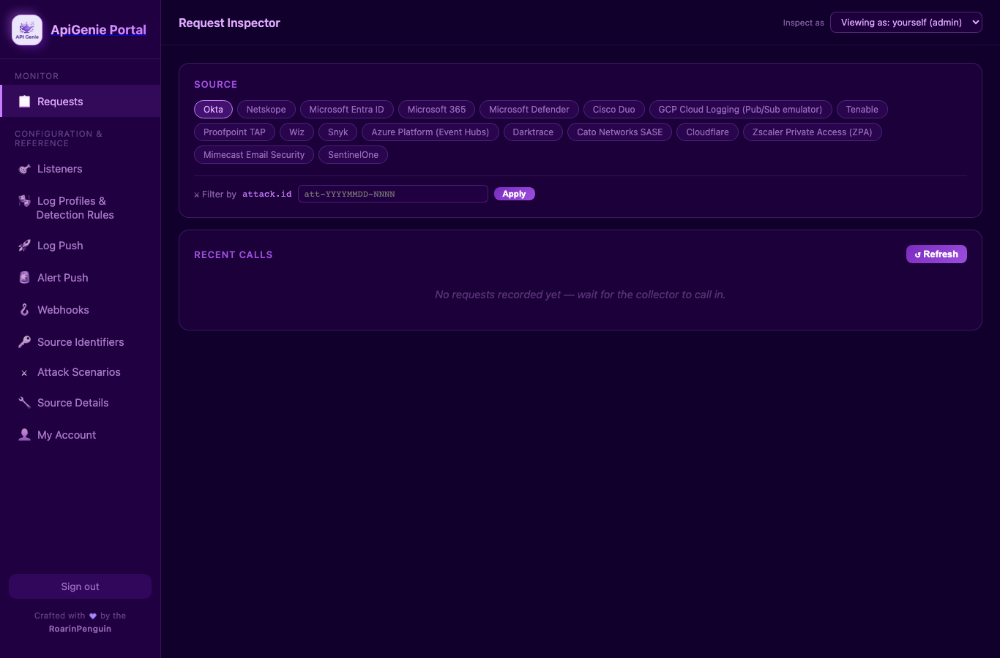

The top-right corner of every page shows your **avatar**. Administrative areas (Observability, Intrusions, Investigations, Container Logs, System Settings) are hidden from a normal user's sidebar and blocked at the server even if reached directly.

### 1.4 The "My Account" page

Click **👤 My Account**. Here you manage your identity and personal integration settings:

- **Email address** — cosmetic only (API Genie never sends mail), with a **Save email** button.
- **Change password** — supply your current password and a new one (min 8 chars). This always changes *your own* password, even when an admin is viewing the portal "as" you.
- **My SentinelOne console** — optionally point API Genie at *your* SentinelOne tenant (**URL** + **API token**). When set, every detection-rule import and enrichment in your session uses your tenant instead of the global one. As of **v5.1**, these credentials are **stored only in your browser** (`localStorage`) and sent on each request as `X-S1-Console-URL` / `X-S1-Console-Token` headers — **the server never persists them**. They live on the device you entered them on; clearing them (or your browser storage) removes the override and falls back to the global settings.

Your **avatar** is managed from the circle in the top-right of any page: click it to upload a JPEG/PNG (auto-cropped to a circle, max 5 MB); a small **×** badge removes it.

### 1.5 The "Source Identifiers" page

Click **🔑 Source Identifiers**. Every pull source (Okta, SentinelOne, Cloudflare, …) is a single shared endpoint that everyone hits. API Genie tells *your* traffic apart from everyone else's by the **credential your collector presents**. A source identifier is you declaring: *"when a request arrives carrying this token / tenant id / API key, that's me."*

To register one, pick the **source**, pick the **kind** (bearer token, tenant id, client id, api key, basic user, subscription, consumer group), type the exact **credential value** your collector will send, and click **+ Register**. From then on, any inbound request bearing that value is matched to your account and the response is shaped with *your* bound log profile, custom fields, and detection-rule injections. Values are globally unique, and the built-in shared demo tokens are reserved (they always map to the public profile).

> The **🔧 Source Details** tab is a companion reference: a copy-pasteable card per platform with the exact endpoint paths, auth headers, and `curl`/`kcat` examples your collector needs.

### 1.6 What you can and cannot see (entitlements)

Your capabilities come from the single **entitlement** the admin assigned you. An entitlement grants permission levels — **View**, **Create**, **Modify**, **Delete**, **Operate** — across categories such as Log Profiles, Detection Rules, Log Push Profiles, Custom Listeners, and Source Bindings. You see your own objects plus anything an admin published as **public** (view/clone only); you never see another user's private objects, and actions you lack permission for are both hidden in the UI and refused by the server. If you can't do something you expect to, ask your admin to adjust your entitlement.

---

## 2 · Generate telemetry with API-based Log Pull — common sources

In **log-pull** mode, *your collector does the work*. An external collector — an Observo site collector, a SIEM poller, an OpenTelemetry scraper, or plain `curl` — makes an outbound request to one of API Genie's endpoints, and API Genie answers as the vendor's API would, with realistic synthetic telemetry. API Genie never reaches out to you in pull mode; it only responds when polled.

### 2.1 The model

Every common source is a **single, shared endpoint** — every Okta collector polls the same `GET /api/v1/logs`, every SentinelOne collector hits `GET /web/api/v2.1/threats`, and so on. API Genie identifies *who is calling* from the credential the collector presents, matches it to your registered **Source Identifier** (§1.5), and shapes the response for you. Authentication uses whatever the real vendor expects — `Authorization: SSWS …` for Okta, `ApiToken …` for SentinelOne, `Bearer …` for OAuth sources, `X-ApiKeys` for Tenable, HTTP Basic for Duo/Proofpoint, and so on — and pagination follows the real vendor's shape so your collector's existing logic works unchanged.

### 2.2 The Request Inspector

The **Requests** tab shows a live, per-source trace of every inbound pull. Pick a source chip at the top to see its recent calls — timestamp, method, path, status, latency, client IP, and an expandable request/response detail.

This is your immediate feedback loop: point a collector at API Genie, refresh the tab, and watch the calls land with their response sizes and previews.

### 2.3 The supported common sources

API Genie ships realistic pull APIs for a broad catalogue of platforms, grouped by how a collector authenticates and pages:

| Group | Sources | Auth shape |
|---|---|---|
| **Bearer / token header** | Okta, Netskope, Microsoft Defender, Snyk, Cloudflare, SentinelOne | `SSWS` / `Bearer` / `ApiToken` token; `Link`-header or cursor paging |
| **OAuth2 two-hop** | Microsoft Entra ID, Microsoft 365, Wiz, Zscaler Private Access (ZPA), Mimecast | POST for a token, then poll with `Bearer`; cursor/`pageInfo` paging |
| **API-key / signed header** | Cisco Duo, Proofpoint TAP, Darktrace, Cato Networks SASE | HTTP Basic / HMAC / `x-api-key`; offset or marker paging |
| **Async export (stateful)** | Tenable | `X-ApiKeys`; `export → status → chunks` three-step flow |
| **Streaming (broker / RPC)** | Azure Platform (Event Hubs / Kafka), GCP Cloud Logging (Pub/Sub) | SASL on `:9093/:9094`, gRPC on `:8443/:8085` |

Each source returns content that mirrors the real vendor's schema (Okta system log, SentinelOne threats with MITRE mappings, Microsoft Graph audit/sign-in events, Tenable vuln chunks, …), so downstream parsers and detections behave exactly as they would against production data. The streaming sources are fed by a background publisher that emits fresh events every few seconds, so a consumer always has something to read.

---

## 3 · Generate telemetry with API-based Log Pull — custom listeners

When no built-in source matches what you want to demo, build your own endpoint from the **🎯 Listeners** tab. A **listener** is an HTTP (or OTLP) endpoint you define at runtime, exposed at `https://apigenie-poc.roarinpenguin.com/listener/<id><path>`.

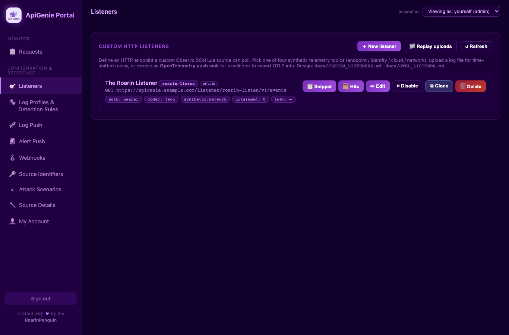

### 3.1 The "New listener" wizard

Click **＋ New listener** to open a four-step wizard.

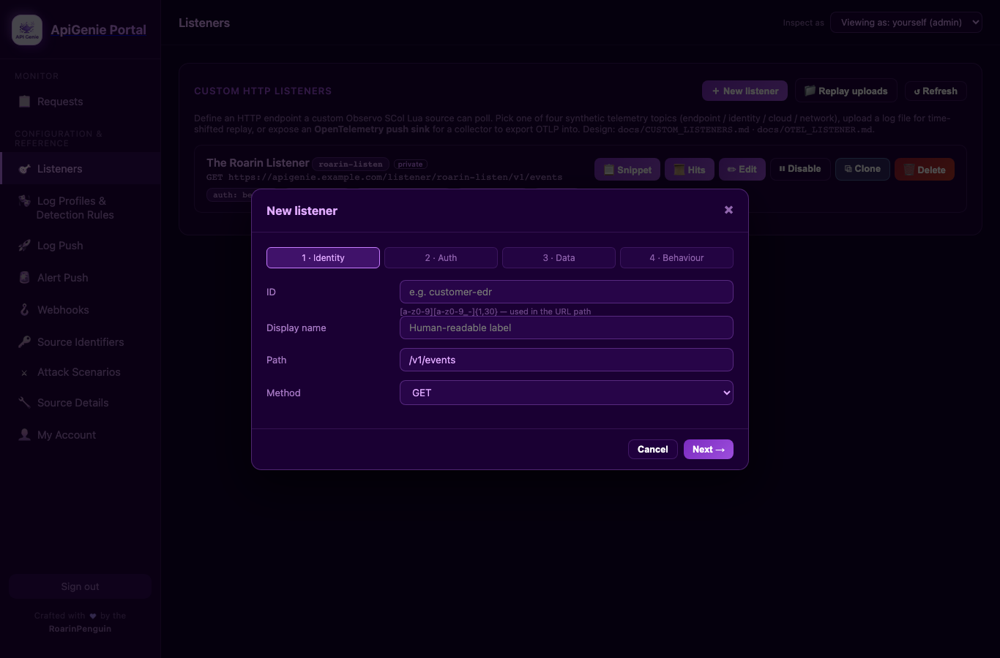

- **① Identity** — the **ID** (slug used in the URL), a **Display name**, the **Path** (e.g. `/v1/events`), and the **Method**.
- **② Auth** — `None`, **Bearer token**, **HTTP Basic**, **OAuth2 client_credentials**, or **X-Api-Key header**.
- **③ Data source** — choose one of three engines (below).
- **④ Behaviour** — the **Codec** (JSON, NDJSON, RFC 3164 syslog, OTLP protobuf/JSON), **Pagination** (none / cursor / page number / since), and resilience knobs (**rate-limit every Nth request → 429**, **chaos every N → 503**) to exercise your collector's retry logic.

The heart of the wizard is **Step 3 — the data source**:

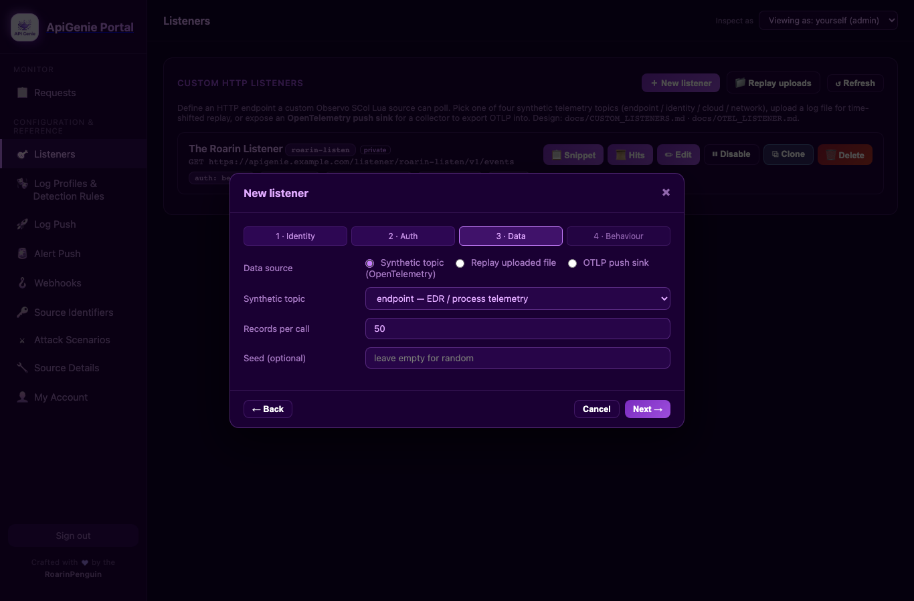

1. **Synthetic topic** — generate fresh events from one of four profile-aware generators: `endpoint` (EDR), `identity` (SSO/IAM), `cloud` (multi-cloud audit), or `network` (Zeek-style flows), with a records-per-call count and an optional seed.
2. **Replay uploaded file** — stream an uploaded capture (JSONL/JSON/CSV/syslog/CEF), time-shifted so it looks like it's happening *now*. Manage uploads with the **📁 Replay uploads** button.
3. **OTLP push sink (OpenTelemetry)** — turn the listener into a mock OpenTelemetry receiver.

### 3.2 Using your listener

Each listener row shows its full URL, auth/codec/data-source pills, and live hit counts. Two row actions are especially useful:

- **📋 Snippet** — a ready-to-paste **Lua** collector loop and matching **Source YAML** for Observo.
- **📜 Hits** — a per-listener live trace of every inbound poll (this is where listener traffic appears — not in the Request Inspector), with decoded auth identity and the last responses sent.

### 3.3 The OTLP listener

The **OTLP push sink** lets your OpenTelemetry collector export logs, metrics, or traces *into* API Genie, which returns the spec-compliant ack so the export succeeds. It accepts both transports:

- **OTLP/HTTP** on `:443` at `…/listener/<id>/v1/logs` (protobuf or JSON).
- **OTLP/gRPC** on `:4317`, routed by metadata — preferentially `x-apigenie-listener-id: <id>`, with fallbacks for the Grafana `x-scope-orgid` tenancy convention and bearer-token matching.

Decoded exports render in the **Hits** pane with a **📡 OTLP** pill and an expandable preview of resource attributes and the first records.

---

## 4 · Generate telemetry with Log Push

**Log Push is the mirror image of log pull.** Instead of waiting to be polled, API Genie actively *sends* generated logs out to a destination you configure — a syslog server, an HTTP/HEC collector, an OpenTelemetry collector, your SentinelOne tenant. This is how real firewalls, EDRs, and email gateways actually deliver telemetry: they originate the connection and stream events to you. Reach for Log Push when you want to validate an ingestion pipeline end-to-end, drive a continuous rate-controlled stream, or replay a captured log file into a destination.

Open the **🚀 Log Push** tab. Existing **Push Profiles** are listed as cards with quick **Start / Edit / Events** controls; each card shows its source, format, transport, destination, rate, and status.

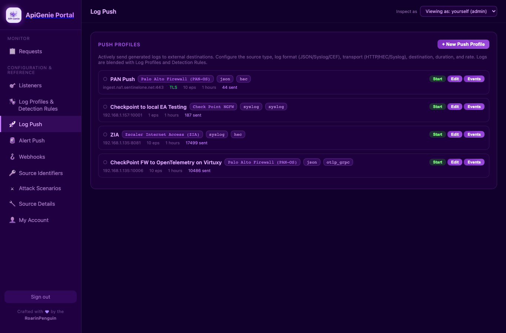

### 4.1 Creating a Push Profile

Click **+ New Push Profile**. A profile is a saved, reusable definition of *what* to send, *how* to format it, *where* to send it, and *how fast / how long*.

- **Name** and **Source Type** — the synthetic generator that produces the events. The catalogue includes vendor sources (Palo Alto, FortiGate, Check Point, Cisco ASA/FTD, CrowdStrike, Carbon Black, Zscaler, Imperva, Barracuda, Infoblox, SentinelOne, Corelight/Zeek, CyberArk, Stamus, switches…), the four synthetic topics (endpoint/identity/cloud/network), and **Replay — uploaded log file**.
- **Format** — **JSON**, **Syslog (RFC5424)**, or **CEF**.
- **Transport** — **HTTP POST**, **HEC**, **Syslog TCP/UDP**, **OTLP/HTTP**, or **OTLP/gRPC**. The editor reveals the right destination fields and applies smart port/TLS/path defaults as you choose.
- **Destination** — Host/IP, Port, Protocol (for syslog), **TLS**, and the HTTP **Endpoint Path**.
- **Authentication** (HTTP/OTLP) — None, Bearer Token, or Basic Auth.
- **HEC destination** (HEC transport) — **S1 DPM (Observo)**, **S1 AI SIEM**, or **Splunk HEC Compatible**, plus the **HEC token**.
- **Rate & Duration** — events per second (1–1000) and how long to run (seconds → weeks).
- **Log Profile** — optionally bind the push to one of your Log Profiles (§7) so the events use *your* entities and fire *your* detection rules.
- **Visibility** — Private or Public.

For replay sources, pick an uploaded file; records stream in file order with timestamps shifted to "now", and the push completes gracefully when the file is exhausted.

### 4.2 Running a push and reading its status

**Save**, then **Start**. A running profile shows a green status dot, a live "N sent" counter, and a "since …" timestamp. Click **Events** on a card to expand its per-event log — the last 100 events, newest first, each with a delivery badge (`[hec 412B 200]`, `[udp 96B unconfirmed]`, `[tcp+tls 312B ok]`) and an expandable payload preview. Send failures are retried with backoff and counted; UDP is reported as unconfirmed by design. Pushed events also flow into the portal's own observability (Request Inspector, Usage), so you can watch throughput from inside the platform as well as at the destination.

### 4.3 Event Mix — shaping *what* the source talks about

Where a Log Profile decides *who* appears in the telemetry, the **Event Mix** decides *what* the source talks about — the balance of auth successes vs failures vs fraud vs policy changes, and so on. It lives on the **Source Bindings** card as a collapsible **▾ Event mix** disclosure: each event type has an enable checkbox and a relative-weight slider (weights are renormalised at runtime, so the mix is proportional). Because the Log Push worker draws from the same generators, your Event Mix directly shapes the pushed stream — pin SentinelOne to ransomware-heavy, or Cisco Duo to 90% auth failures, and the pushed events follow that distribution.

---

## 5 · Generate Webhook calls

The **🪝 Webhooks** tab is an outbound HTTP request composer. You build a templated request — method, URL, auth, headers, query parameters, and a body — then click **Send**, and API Genie fires it once to your target. It's purpose-built to light up a third-party SIEM/SOAR with a synthetic alert, or to drive any HTTPS endpoint with shaped events.

The left rail lists the webhooks you can see; pick one to load it, or click **+ New Webhook** for a fresh one.

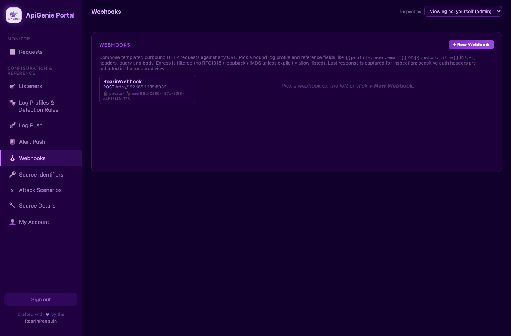

### 5.1 The editor

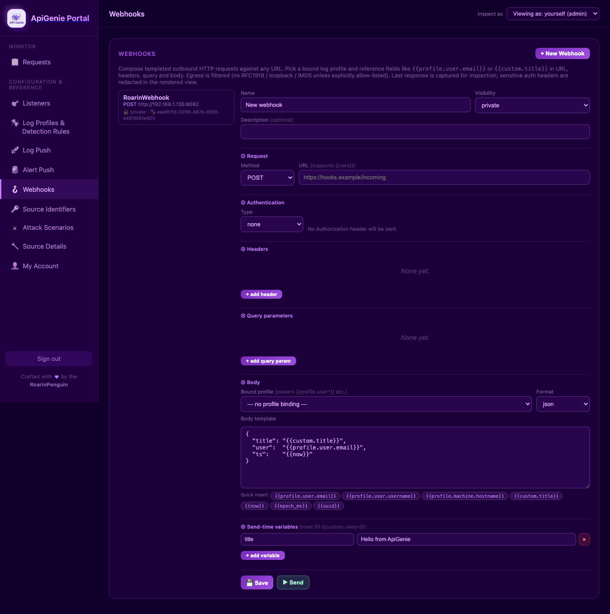

The editor is laid out in numbered sections: **name/visibility/description**, **Method + URL**, **Auth type** (none / bearer / basic / custom), **Headers**, **Query parameters**, and **Body** (with a **Bound profile**, a **Format**, a body template, and a **Quick insert** palette of variable chips). At the bottom, **Send-time variables** fill the `{{custom.<key>}}` namespace and are pre-populated so the first send works out of the box.

Templates are rendered with a small variable engine. You can reference a randomly-picked entity from the bound profile (`{{profile.user.email}}`, `{{profile.machine.hostname}}`, `{{profile.c2.*}}`, `{{profile.malware.*}}`, `{{profile.mail_sender.*}}`), send-time custom values (`{{custom.title}}`), and helpers like `{{now}}`, `{{epoch}}`, `{{epoch_ms}}`, and `{{uuid}}`. All references to the same entity resolve to the *same* person within a single send.

### 5.2 Sending and inspecting

**Send** auto-saves the draft first, so what went out always matches what's saved. A **Last response** card then shows the HTTP status and elapsed time, the **effective request** (final URL, method, headers with sensitive auth shown as `<redacted:****XXXX>`, rendered body), the response, and a **📋 Copy as curl** button. Guardrails protect you and the platform: an egress allowlist blocks RFC1918 / loopback / link-local / IMDS targets unless explicitly allowed, there's a 10-second timeout and a 64 KiB response cap, and the rendered body is JSON-validated before it leaves the wire.

---

## 6 · Generate Attack Scenarios

An **attack scenario** is a multi-source, multi-phase campaign mapped to the MITRE ATT&CK kill chain. Each phase targets one log source for a slice of the scenario's duration and injects correlated telemetry tagged with a single **`attack.id`** (format `att-YYYYMMDD-NNNN`) and a **`phase.id`** (the MITRE tactic). A background scheduler opens and closes each phase on time, backdates events across the requested window, and auto-starts/stops any push sources a phase needs.

Open the **⚔ Attack Scenarios** tab. Each scenario card shows the MITRE kill-chain timeline, the live `attack.id` pill, elapsed-vs-total time, and **Events / Timeline / Export / Edit / Start (or Pause/Stop)** controls.

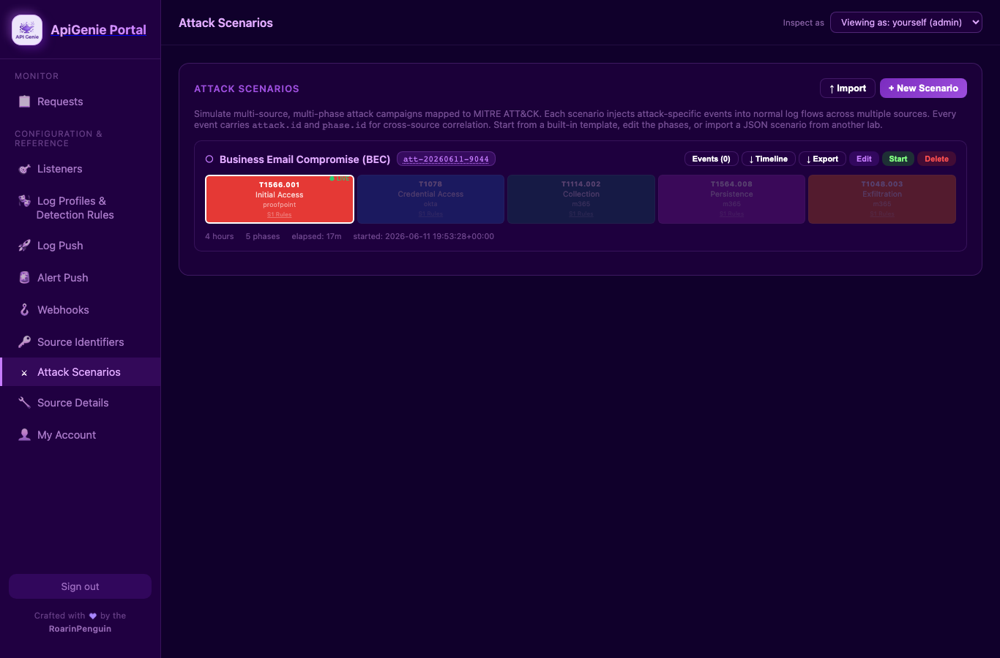

### 6.1 The scenario library and creating a run

Click **+ New Scenario**. You can start from one of five built-in templates or build from scratch.

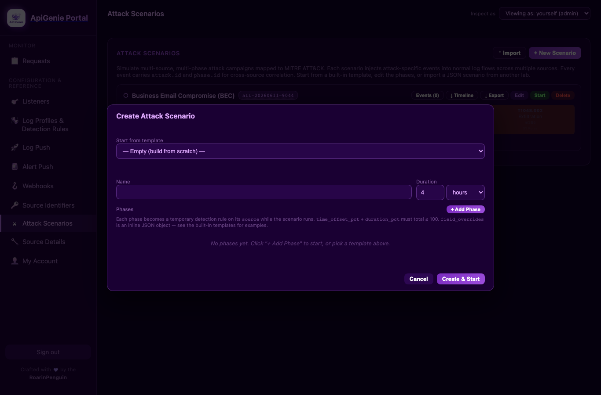

The built-in templates are:

- **Business Email Compromise (BEC)** — phishing → credential theft → mailbox access → inbox rule → exfiltration (Proofpoint, Okta, M365).
- **Ransomware via Lateral Movement** — exploitation → C2 → credential dumping → lateral movement → discovery → ransomware (Palo Alto, SentinelOne, Entra ID).
- **Cloud Account Takeover** — token theft → illicit consent → discovery → privilege escalation → data theft → persistence (Okta, M365, Entra ID).
- **DNS Poisoning + Data Exfiltration** — DNS manipulation → C2 over DNS → recon → evasion → exfiltration → cleanup (Infoblox, FortiGate, Zscaler, M365).
- **Insider Threat — Disgruntled Employee** — excessive access → email exfil → cloud upload → off-hours VPN → tampering → anomalous login (M365, Netskope, Cisco Duo, Okta).

Set a **Name** and **Duration**, tune the per-phase **Source / MITRE tactic / technique / timing / field overrides** if you wish, and click **Create & Start**. Each start generates a fresh `attack.id`.

### 6.2 A live run

Starting the BEC template produces a running campaign with a fresh `attack.id`, the five-phase timeline lit up (active / next / pending), and the duration ticking.

Click **Events** on a running card to watch the per-scenario event log stream beneath the timeline — timestamp, phase id, source, and the salient fields of each generated event. **Timeline** exports a flat chronological JSON snapshot of the whole run.

### 6.3 Correlating by attack.id

The **Request Inspector** carries a **⚔ Filter by `attack.id`** box. Enter a run's id and click **Apply** to pivot the recent-calls view into cross-source correlation mode, highlighting every inbound request whose response carried that `attack.id`.

Two things to know about this lens (the UI states them inline): it scans the in-memory request-trace buffer, which keeps the **last 100 calls per source**, and it sees **inbound pull traffic only** — push-source phases bypass the trace, and the tag is injected for the *owner's* pulls, so for push-heavy scenarios the per-scenario **Events** panel is the authoritative record.

---

## 7 · Customize your telemetry with Log Profiles and Detection Rules

Out of the box, generated events use random actors and hosts. **Log Profiles** and **Detection Rules** let you take control of *who* appears in your telemetry and *what* detection-worthy patterns get injected — so the same user, machine, or C2 server shows up correlatably across every source at once, and your SIEM/XDR rules light up on demand. Both live on the **🎭 Log Profiles & Detection Rules** tab.

### 7.1 Log Profiles

A Log Profile is a reusable pool of entities — **Users**, **Machines**, **C2 Servers**, **Malware**, and **Mail Senders** — that gets blended into generated logs. Click **+ New profile** to define them.

Each user entity is rich (name, email, department, city, role, workstation, server, IPs), so the same person can appear as the actor in an Okta sign-in *and* the device in a downstream alert. If you define fewer entities than a pool's limit, API Genie tops it up with themed characters so generators never run dry, and a per-profile **seed** makes runs reproducible.

A profile takes effect when **bound** to a source on the **Source ↔ Profile Bindings** card, with two dials:

- **Ratio** (signal-to-noise, 0–100%) — the share of events that draw from your profile pool vs random noise.
- **Log volume / intensity** (1–100%) — how many entries each response contains.

### 7.2 Detection Rules

Where profiles control *who*, detection rules control *what happens* — they inject log patterns crafted to trigger SIEM/XDR detections. Click **+ New Rule**.

A rule has a **Name**, a **Source**, **Field overrides** (dot-notation, e.g. `outcome.result` → `FAILURE`), a **Periodicity**, and an **Enabled** toggle. Periodicity is interpreted two ways: **1–100** is count-based (inject one detection event per *N* normal logs), while **>100** is time-based (inject once every *N* seconds). Each injected event is a deep copy of a normal log with your overrides applied and a `_detection_rule` marker added, inserted into the batch. Rules apply across all HTTP sources plus the Kafka and Pub/Sub publishers.

> **Tip — the S1 Detection Library.** The **Browse S1 Library** button can pull real SentinelOne detection rules and map their query fields back to the original vendor field names, turning them into local detection rules — so your injected events match exactly what a real S1 rule looks for.

### 7.3 Multi-user behaviour

Profiles, rules, and bindings are **owner-scoped**. Your private objects are yours alone; public ones are visible (view/clone) to others. Per-user bindings shadow the global one — when a request resolves to you (via your Source Identifier), API Genie applies *your* binding and fires only the rules *you* can see. This is what lets many people share one deployment while each receives their own flavour of the same source.

---

## 8 · Generate alerts for the SentinelOne Singularity platform

The **🚨 Alert Push** tab ships pre-built **OCSF Findings** into the SentinelOne **Unified Alert Management (UAM)** ingest API, where they land as alert tiles — optionally **bound** to a real asset and **enriched** with MITRE ATT&CK mappings and observables. This is how you light up the Singularity inbox (and Purple AI correlation) with synthetic-but-realistic detections.

The tab lists your **Alert Push Profiles**, each with quick **⚡ Send 1** / **⚡ Send 5** buttons, plus **⚡ Send Custom Alert** and **+ New Alert Profile** at the top right.

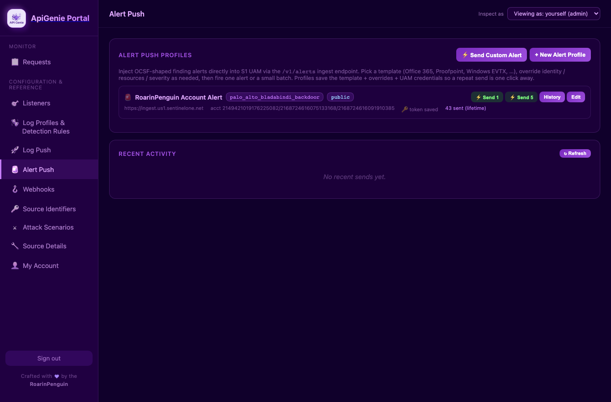

### 8.1 Building an Alert Profile

Click **+ New Alert Profile**.

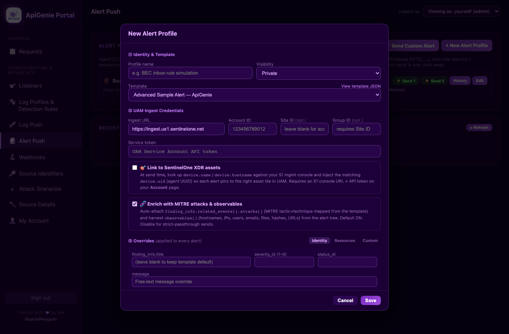

- **① Identity & Template** — a **Profile name**, **Visibility**, and a **Template** chosen from a catalogue of ~70 OCSF Finding templates grouped by product (Microsoft 365, Proofpoint, Windows Event Log, Palo Alto, SharePoint, and generic samples). A **View template JSON** link previews the chosen template.
- **② UAM Ingest Credentials** — the **Ingest URL** (default `https://ingest.us1.sentinelone.net`), **Account ID**, optional **Site ID** / **Group ID**, and a write-only **Service token**.
- **Two switches** — **🎯 Link to SentinelOne XDR assets** (looks up the device against your S1 console and pins the alert to the right asset tile) and **🧬 Enrich with MITRE attacks & observables** (on by default; attaches ATT&CK mappings and harvests hostnames/IPs/users/files/hashes/URLs).
- **③ Overrides** — Identity / Resources / Custom sub-tabs to override title, severity, resource name/type, and arbitrary dot-path fields on every alert.

On send, API Genie deep-copies the template, injects fresh UIDs and timestamps, applies your overrides, resolves assets, enriches, and POSTs a gzip-compressed OCSF Finding to `…/v1/alerts` with the correct `Authorization` and `S1-Scope` headers. Accepted alerts typically surface in UAM within ~10–30 seconds.

### 8.2 Sending an ad-hoc alert

For a one-off without saving a profile, click **⚡ Send Custom Alert**: provide the UAM credentials, paste a complete OCSF Finding JSON, and click **⚡ Send**. The **auto-generate fresh UID** checkbox (on by default) runs the same prep so the alert isn't silently de-duplicated by S1.

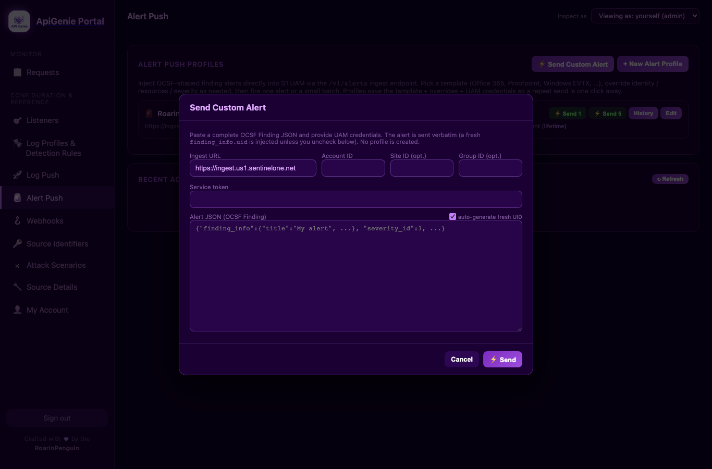

> **Asset binding, the one rule that matters:** for an alert to bind to a real asset tile, `resources[0].uid` must be the 26-character **XDR Asset ID** from your S1 console — which is exactly what **Link to SentinelOne XDR assets** fills in for you when it finds a name match.

---

# Part III — Administering API Genie

Part III is written for the **administrator**. Everything here happens in the **admin console** at `https://apigenie-poc.roarinpenguin.com/admin` — a separate console from the user portal, with its own login and its own session. The admin is a superuser: it implicitly holds every permission and bypasses all ownership and visibility checks.

---

## A. Admin access and the console

Sign in at **`https://apigenie-poc.roarinpenguin.com/admin`** with the admin username and password. The admin password is stored as a salted hash (from the `ADMIN_PASSWORD_HASH` environment variable, or an override file after the first in-app change), and the session is held in the same 24-hour cookie used elsewhere. Source-data tokens (the credentials collectors present) are a completely separate auth surface and never overlap with the console session.

The console's left navigation is grouped into:

- **Monitor** — Observability and Requests
- **Troubleshooting** — Intrusions, Investigations, Container Logs
- **System** — System Settings (which also hosts RBAC)

The landing view is **Intrusions**. Note that the same feature tabs a user sees (Listeners, Log Push, Alert Push, …) are also reachable from the admin console, but the admin-only Monitor/Troubleshooting/System areas are the focus of this part.

---

## B. Observability

Observability (**Monitor → Observability**) is the admin's single pane for *who is calling, how much, and how the platform is holding up*. Four sub-views sit behind the tabs at the top — **Flows**, **GeoMap**, **Usage**, **System** — with a time-range selector (**1h / 6h / 24h / 7d / 30d / 90d / 1y**).

### B.1 Flows

The **Flows** view is a Sankey diagram mapping **source IPs → log sources**, with a **min-volume slider (1–50)** to suppress one-off noise and surface the heavy talkers. Bus-based consumers (Kafka consumer groups, Pub/Sub subscriptions) are folded in alongside HTTP sources.

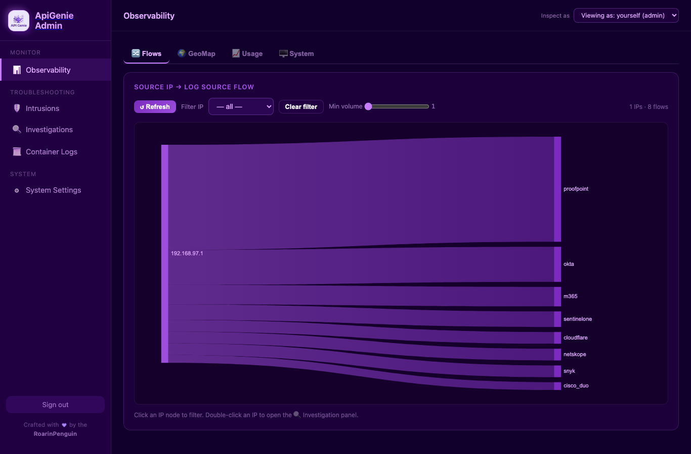

> Flows and GeoMap plot **public** client IPs; loopback / RFC1918 addresses are treated as private and don't appear as edges. In a lab reached over a loopback or private address the diagram can read "0 flows" even while data is flowing — the **Usage** view confirms the traffic.

### B.2 Usage

The **Usage** view is a stacked-area chart of request volume over time, broken down per source, with the bucket size adapting to the selected range. It is your per-source consumption report — which integrations are pulling, how hard, and when.

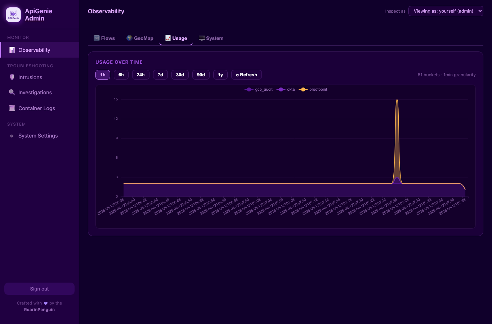

### B.3 System

The **System** view shows real-time host **CPU / RAM / disk** plus per-container resource use (app, nginx, Kafka, Pub/Sub, ZooKeeper) and CPU/memory-over-time charts.

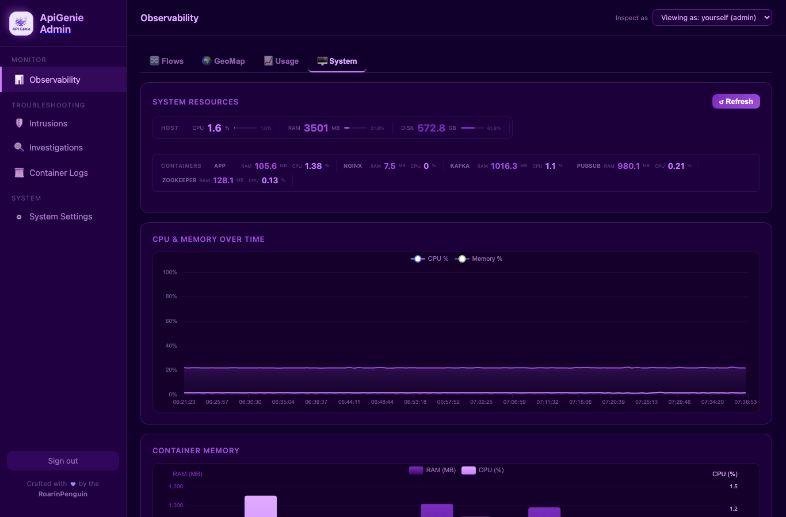

### B.4 Request inspection across all users

The admin's **Requests** tab is the same live trace users see, except the admin sees traffic from *all* users. Each request detail includes a **Resolved caller** row showing which principal a source token resolved to — a named user, `anonymous` (unmatched), or `reserved` (a shared demo token / public profile).

---

## C. Troubleshooting

The **Container Logs** viewer (**Troubleshooting → Container Logs**) tails any container in the stack live, streamed to the browser. Pick a container from the selector (`apigenie`, `apigenie-nginx`, `apigenie-kafka`, and the rest), click **Start**, and the view follows new lines as they arrive — the first stop for "the app is 500ing" or "Kafka isn't consuming" problems, with no need to shell into the host.

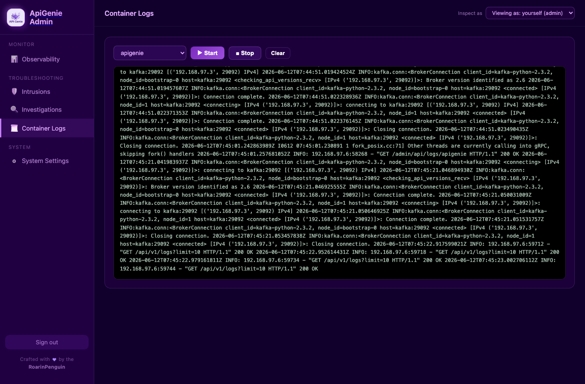

The other two Troubleshooting items, **Intrusions** and **Investigations**, are security workflows covered in §E.

---

## D. RBAC — entitlements, users, and access

Access control has three layers that must all agree: **authentication** (who you are), **authorization** (your entitlement grants an action in a category), and **ownership & visibility** (which specific objects). The admin bypasses all three. RBAC is managed at the bottom of **System Settings**, which also hosts the platform's identity, TLS, SentinelOne, webhook-egress, and admin-password settings.

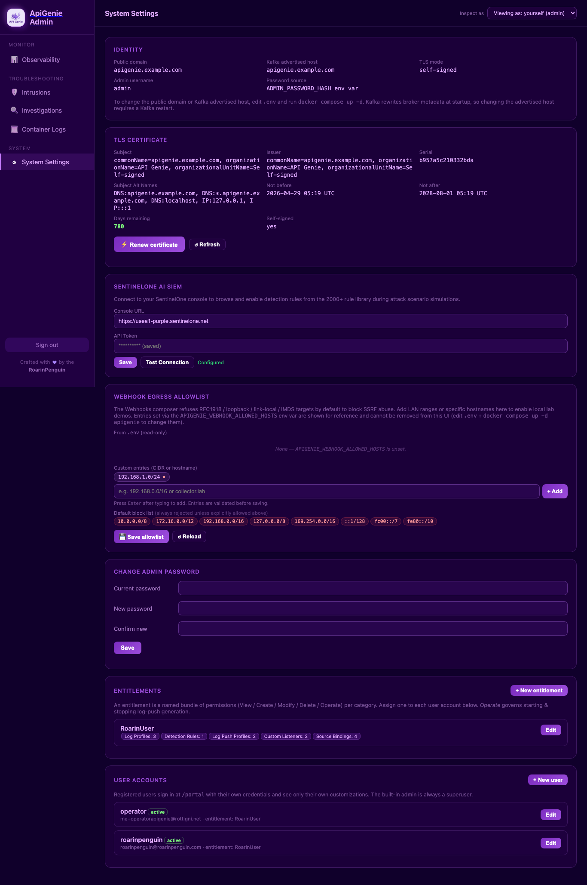

### D.1 Entitlements

An **entitlement** is a named bundle of permissions. Click **+ New entitlement** to define one: for each **category** (Log Profiles, Detection Rules, Log Push Profiles, Alert Push Profiles, Custom Listeners, Source Bindings, Webhooks) tick the permission levels **View / Create / Modify / Delete / Operate**.

- **View** — see your own + public objects.
- **Create** — make new objects, and clone shared ones into your own copies.
- **Modify / Delete** — edit / remove objects you own.
- **Operate** — start & stop generation (meaningful for Log Push).

Each user is assigned exactly one entitlement; editing the entitlement updates everyone who shares it.

### D.2 Users and the setup-link handoff

Click **+ New user** to create an account: a **Username**, an optional **Email**, an **Entitlement**, and a **Password** field.

Leave the password **blank** and API Genie returns a one-time **setup link** (`/portal/set-password?token=…`) that you hand to the user out-of-band — no SMTP required. The token is single-use and expires in 7 days; issuing a new reset link invalidates the previous one. You can also set a password inline, reset a user's password directly, or **disable** an account (which blocks login and bounces live sessions without destroying any of the user's data).

### D.3 Per-user SentinelOne console and "Viewing as"

Each user can set their own SentinelOne **console URL + API token** (on their My Account page); when set, their S1 operations route to *their* tenant. As of **v5.1 (Phase A)** these per-user credentials are **browser-only** — held in the user's `localStorage` and forwarded as `X-S1-Console-URL` / `X-S1-Console-Token` request headers; the server stores nothing (the old `users.console_url` / `console_token` columns were removed). A practical consequence for admins: because the credential lives on the user's device, "Viewing as" a user does **not** inherit their S1 console — to act against a specific tenant you supply the console yourself. The **admin-global** S1 token, by contrast, *is* stored server-side, encrypted at rest (see §F). To reproduce or troubleshoot a user's setup, the admin signs into `/portal` and uses the **"Viewing as"** switcher in the top-right: pick a user and an amber banner appears, after which every owner-scoped read and write happens in *that user's* namespace with *that user's* permissions — no second login, and no need for the user's password. Clicking **Stop** returns to the admin's own view. (Password changes are the one action that always applies to the admin's own account, never the target's.)

---

## E. Security — Intrusions, Investigations, and Ban

### E.1 Intrusions

The **Intrusions** view (the admin landing page) captures every request to an **unrecognised path** — scanners and bots probing `/wp-admin`, `/.env`, `/actuator`, and the like. It has four panels: a **Threat Summary** (unique IPs, total attempts, category breakdown), **Top Offenders** (IPs ranked by attempts, each with a one-click **Ban**), **Recent Intrusion Attempts** (time / IP / method / path / status / category / user-agent), and **Acknowledged Paths** (known-good paths you've suppressed).

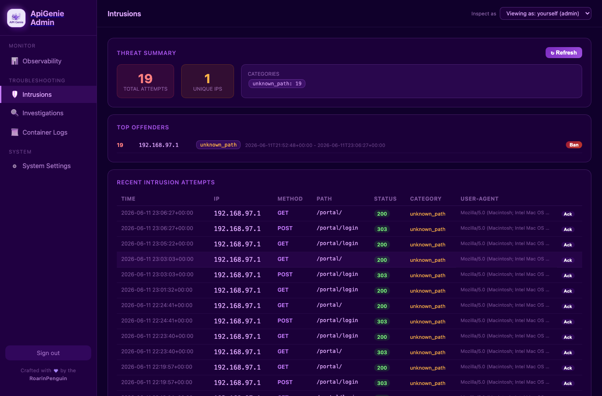

Paths are auto-classified (credential theft, WordPress/PHP scans, framework probes, RCE attempts, admin-panel scans, k8s probes, info disclosure, and the catch-all `unknown_path`). Acknowledging a path — optionally with multi-condition `path:` / `prefix:` / `ip:` / `cat:` logic — suppresses future hits while still counting them.

### E.2 Investigations

The **Investigations** view is an IP-centric triage workflow: enter an address to pull its **WHOIS, reverse DNS, and GeoIP**, its full **request history** from the persistent request log, and anomaly signals. It's where you pivot from "this IP looks suspicious" to a decision — and it exposes the same **Ban** action.

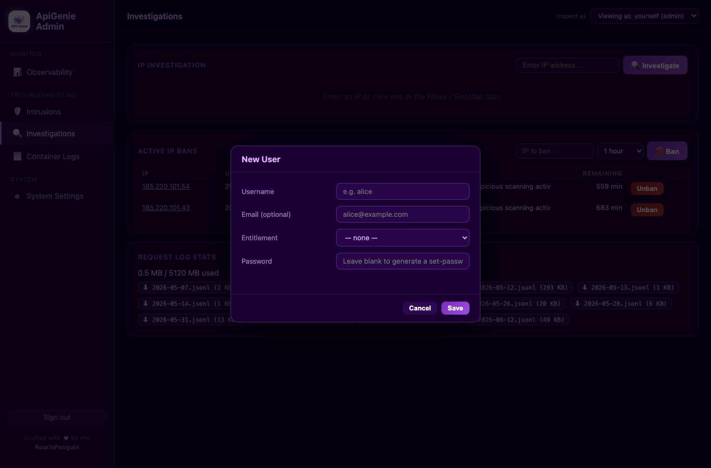

### E.3 Ban

The **Ban** action (from Top Offenders or Investigations) creates a persistent, time-boxed ban (default 1 hour). Bans are checked in O(1) on **every** request before any routing, so a banned IP is rejected outright; expiry is lazy and bans can be listed or lifted at any time.

---

## F. Storage, secrets, and data protection

Everything API Genie persists lives under a **single data volume** — `./data` on the host, mounted at `/var/lib/apigenie` in the container. Back up that one directory (a `tar` of `./data/`) and you have captured the entire platform state; the volume is fully portable across hosts.

### F.1 Where things are stored

| What | Path under `./data/` |
|---|---|
| Accounts, entitlements, source identifiers, recovery/setup tokens (RBAC core) | `apigenie.db` (SQLite, WAL) |
| Admin & legacy user-portal password hashes | `admin_pass` · `user_pass` |
| **Admin-global SentinelOne console settings** (token **encrypted at rest** — see F.2) | `s1_settings.json` |
| Log Profiles | `profiles/<uuid>.json` |
| Source ↔ profile bindings · per-source intensity | `source_profiles.json` · `source_intensity.json` |
| Event-mix overrides (per user) | per-user JSON (same pattern as bindings) |
| Detection rules | `detection_rules.json` |
| Custom listeners · replay uploads | `listeners/<id>.json` · `replays/<uuid>.*` |
| Log-Push profiles · push TLS certs | `push_profiles.json` · `push_certs/*.pem` |
| Acknowledged intrusion paths · IP bans | `acknowledged_paths.json` · `bans.json` |
| Usage telemetry · daily request logs | `telemetry.db` · `request-logs/YYYY-MM-DD.jsonl` |
| Per-user avatars | `avatars/<uid>.png` |
| **At-rest encryption key** (auto-generated fallback) | `secret.key` (mode `0600`) |

> **Per-user S1 console is *not* on this list.** As of v5.1 it is browser-only (`localStorage` → request headers) and never written to disk — see §1.4 and §D.3.

### F.2 At-rest secret encryption (v5.1)

Server-side secrets that API Genie must read on its own — today, the **admin-global S1 API token** in `s1_settings.json` — are **encrypted at rest with Fernet (AES-128-CBC + HMAC)**. The key is resolved in this order:

1. **`APIGENIE_SECRET_KEY`** environment variable — a 44-char url-safe-base64 Fernet key. This is the recommended production path (inject via Docker secrets / AWS SSM). Generate one with:
   `python -c "from cryptography.fernet import Fernet; print(Fernet.generate_key().decode())"`
2. **Fallback:** `./data/secret.key`, auto-generated (mode `0600`) on first run, with a one-time `WARNING` in the logs.

> ⚠️ **Back up the key.** Whether you set `APIGENIE_SECRET_KEY` or rely on `./data/secret.key`, losing it makes every encrypted blob permanently unreadable. Legacy plaintext is detected and silently re-encrypted on the next write, so upgrades need no migration step.

**What it protects:** someone reading `./data/` *off the disk* — a laptop folder synced to cloud storage, a stolen EBS snapshot, a leaked SQLite backup — sees only ciphertext. **What it does not protect:** a running container; a live process needs the cleartext to talk to SentinelOne, so anyone with full filesystem read on a running instance can decrypt offline. Treat host access to a running deployment as equivalent to access to the secrets.

### F.3 Multi-factor authentication — *planned (v5.2)*

> **Not yet available in this release.** MFA is on the roadmap for **v5.2** and is described here so operators can plan. The design: **TOTP** (RFC 6238, Google Authenticator–compatible), one-time **backup codes** (argon2id-hashed at rest), the TOTP seed stored **Fernet-encrypted** using the same key chain as §F.2, a three-state `APIGENIE_MFA_USER_POLICY` (off / optional / required), and sessions gaining an `mfa_verified` flag that middleware checks before allowing anything outside a small MFA whitelist. When it ships, enrollment will live on the **My Account** page and a verification step will follow login. Until then, access is governed by passwords + the setup-link handoff (§1.1) and the session cookie.

---

# Part IV — Have Data Pipelines? Onboard 12 sources in 10 minutes!

> **About this part.** Part IV reproduces the companion *Data Pipeline* onboarding guide — how to wire SentinelOne **Data Pipeline Integrations** to pull realistic telemetry from API Genie for twelve-plus sources. Hosts have been normalized to `https://apigenie-poc.roarinpenguin.com`.

## Intro

This document is devoted to empowering demo, POC, and testing in general with a live service that provides smooth and plausible log streams for multiple Security Platforms.  
The project is live @ https://github.com/roarinpenguin/apigenie.  
And as usual, let's start with a use case.

## I want to demo Integration with Data Pipelines!

The new Data Pipelines functionality provides the ability to deploy **Integrations**.

The concept of an *Integration* is different from a Pipeline. 

While a Pipeline is built on three *pillars* (source, transforms, destinations), the Integration is deployed as an editable entity composed of:

- A configured **Source**  
- A **Transform** to map the corresponding OCSF categorization and fields based on the configured Source  
- AI SIEM as **Destination**

This is delivering technical and business values: from the mere technical standpoint, an increased operational velocity without renouncing the possibility to enrich or modify the pipeline later, optimizing it. From a more business standpoint, it gives back time to specialized resources while delivering data ingestion agility.

This chapter lists various sources, providing the details to configure the Integrations included in Data Pipelines to reach a live working configuration in no time, with plausible and realistic logs delivered parsed in your AI SIEM.

**NOTE:** because of the OCSF enrichment, it is *perfectly possible and normal* that your logs show an increased volume compared to the ingested one. However, the greater accuracy and quality delivered by OCSF mapping will enable educated choices in removing useless or unneeded parts of the events collected - reaching better volume optimizations once the pipeline configuration is refined later.

### Ingesting Okta Authentication Logs

Let's start with one of the most popular and preferred data source: Okta logs pulled via API.  
In your Singularity Console, click on Data Pipelines to SSO into the Data Pipeline configuration UI, then select **Add Integration** as shown below:  
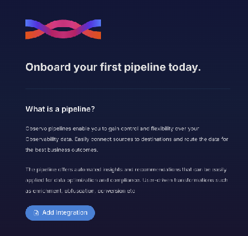 

Select your source to be **Okta**. If it does not appear in the list, start typing it and it will.

Fill in the General Settings page as shown below… you can choose a different name for Integration :) 

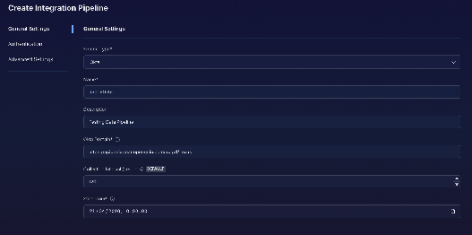

Set the Okta Domain name to **https://apigenie-poc.roarinpenguin.com**

Click on **Authentication**.

Set the Token to **apigenie-valid-token-001**

Click on **Install**.

Congratulations! You have deployed your first pipeline to integrate Okta logs:

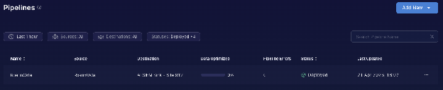

Now click on the Pipeline name to explore the details of it. You will see the ready made OCSF transformation, as well as a Metadata Stamper for troubleshooting purposes.

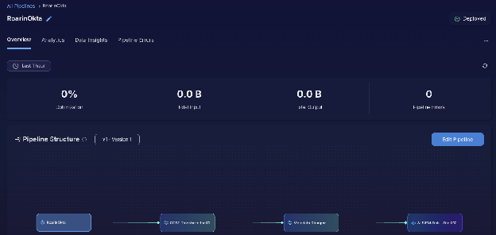

Wait a couple of minutes for the log flow to start, then click on the **Last 1 Hour** button and set it to 5 minutes. You will see some traffic figures.

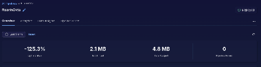

Enjoy your parsed logs by going into your main SentinelOne Console, selecting Event Search - XDR and choosing the dataSource.name to be **Okta**.

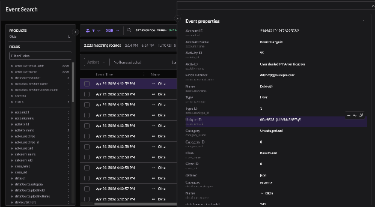

### Ingesting Netskope Logs

The process is similar, but when you get to your Data Pipeline Management configuration screen and you select **Pipelines** there will already be the Okta integration you just successfully deployed.

Hence, from the top right corner select **Add New** and select again **Integration**.

This time, select **Netskope** source.

After you set a *Name* and *Description* of your choice, use the following configuration parameters:

*Alert Types* =\> **all**

*Instance URL* =\> **https://apigenie-poc.roarinpenguin.com**  
*NOTE: if you mouse over to the “i” the system will tell you that the additional path /api/v2/events/data/alert will be appended.*

*Starting DateTime to fetch alerts from Netskope* =\> **set a date**, or you'll hit an error.

Refer to the screenshot below:

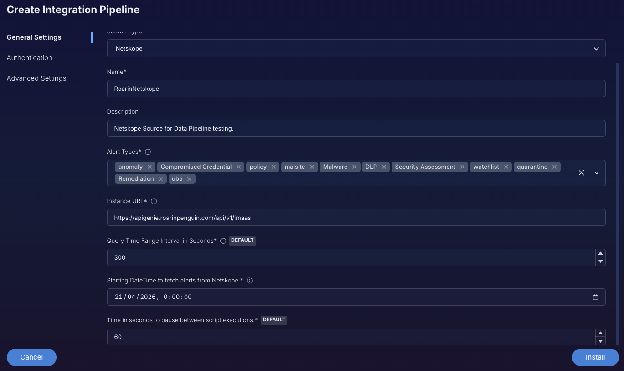

Click on **Authentication** tab

Set the *Token Prefix* field to **Bearer** and the *API Token* field to **apigenie-valid-token-001**

Click on **Install**.

Congratulations! You have deployed your pipeline to integrate Netskope logs:

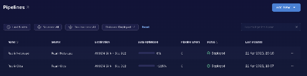

Wait a couple of minutes for the log flow to start, then click on the **Last 1 Hour** button and set it to 5 minutes. You will see some traffic figures.

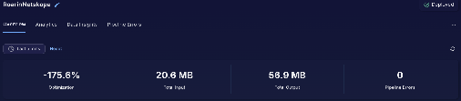

Enjoy your parsed logs by going into your main SentinelOne Console, selecting Event Search - XDR and choosing the dataSource.name to be **Netskope**.

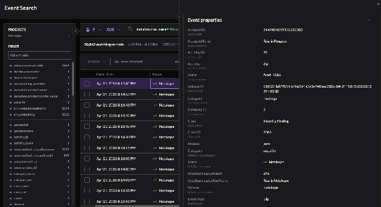

### Ingesting Proofpoint Logs

Again, not hugely different from the previous but the authentication changes a little, hence let's see how it is configured.

Proceed as illustrated in the previous section to add a new Integration, then select **Proofpoint** as a source.

Choose a name and a description, then change the default Proofpoint SIEM API URL *https://tap-api-v2.proofpoint.com/v2/siem/all* with	 **https://apigenie-poc.roarinpenguin.com/v2/siem/all**

Click on **Authentication**

Set *Principal* to **apigenie-principal-001** and *Secret* to **apigenie-secret-001**. 

Click **Install**.

Congratulations! You have deployed your pipeline to integrate Proofpoint logs:

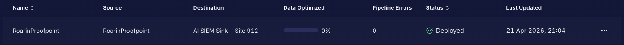

Wait a couple of minutes for the log flow to start, then click on the **Last 1 Hour** button and set it to 5 minutes. You will see some traffic figures.

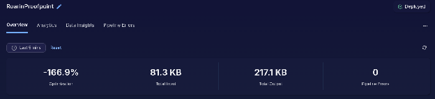

…and consequently in Event Search on AI SIEM searching XDR for   
**dataSource.name = ‘Proofpoint’** 

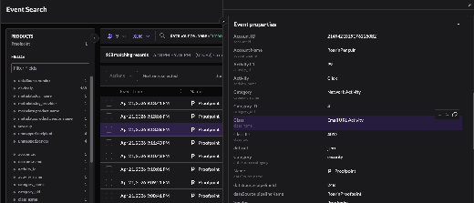

### Ingesting Wiz Logs

Technically this is a *Bearer Token Authentication*, but combined with *OAUTH 2.0*.

Let's examine how this is configured.

Add an Integration for **Wiz** and give it a name and description.

Set the *Wiz API URL* field to **https://apigenie-poc.roarinpenguin.com/graphql**

Set the date for both **Collect Wiz Audit Logs** and **Collect Wiz Issues** to a date of your choice.

Click on **Authentication**.

Set the *Client ID* field to **Bearer** and the *Client Secret* to **apigenie-valid-token-001**.

Set the *Token URL* field to **https://apigenie-poc.roarinpenguin.com/oauth/token**

Click **Install**.

Congratulations! You have deployed your pipeline to integrate Wiz logs:

**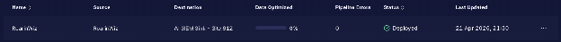**

Wait a couple of minutes for the log flow to start, then click on the **Last 1 Hour** button and set it to 5 minutes. You might see some Warnings or Errors. If this is the case, acknowledge them.  
You will soon see some traffic figures.

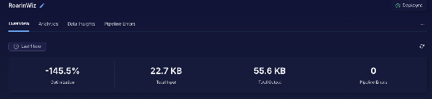

…and consequently in Event Search on AI SIEM searching XDR for   
**dataSource.name = ‘Wiz’** 

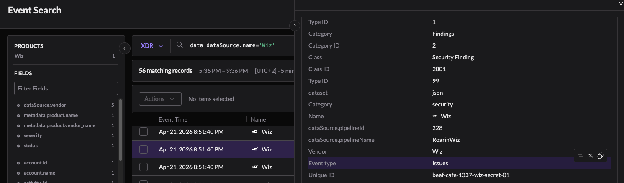

### Ingesting Cisco Duo Logs

This differs a bit from the previous but the API Genie will nicely handle the difference.   
Let's see how it is configured.

Proceed as illustrated in the previous section to add a new Integration, then select **Cisco Duo** as a source.

Choose a name and a description, then set the default *Duo API Host* field to **https://apigenie-poc.roarinpenguin.com**

Set also the date and time for **Authentication**, **Administrator** and **Telephony** logs.

Click on **Authentication**.

Set the *Duo Integration Key* and *Duo Secret Key* to **values of your choice** and let API Genie do the rest by clicking **Install**.

Congratulations! You have deployed your pipeline to integrate Cisco Duo logs:

Wait a couple of minutes for the log flow to start, then click on the **Last 1 Hour** button and set it to 5 minutes. You will see some traffic figures.

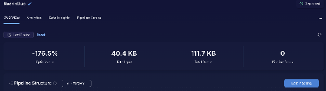

…and consequently in Event Search on AI SIEM searching XDR for   
**dataSource.name = 'Cisco\\ Duo'**

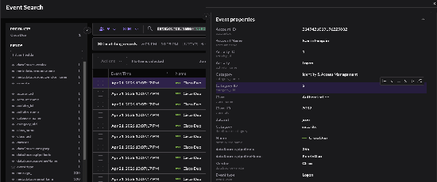

### Ingesting MS Entra ID Logs

This is a source that poses some challenges, but thank goodness they are only if you use API Genie. The challenge is that the source defined through the integration comes with a LUA script in the Advanced Settings. Let's give it a closer look.

Proceed as illustrated in the previous section to add a new Integration, then select **MS Entra ID** as a source.

Choose a name and a description, then set the *Since Time* field as desired. Leave all other settings in *General Settings* unchanged.

Click on **Authentication**.

Set the *Application (Client) ID* and the *Client Secret* fields to **invented values** (of course in real life they would need to match the configuration in Entra ID).

Set the *Token URL* field to 	**https://apigenie-poc.roarinpenguin.com/my-roarin-tenant-id/oauth2/v2.0/token** and leave the rest of the fields unchanged.

Click on **Advanced Settings**.

Expand the Lua Script window by clicking on the  icon.

Locate the portion of the script that reads:

    local base_url

    if is_gcc_high then

        base_url = "https://graph.microsoft.us"

    else

        base_url = "https://graph.microsoft.com"

    end

And change the two URLs to 

    local base_url

    if is_gcc_high then

        base_url = "**https://apigenie-poc.roarinpenguin.com**"

    else

        base_url = "**https://apigenie-poc.roarinpenguin.com**"

    end

Click **Install.**

Congratulations! You have deployed your pipeline to integrate MS Entra ID logs:

Wait a couple of minutes for the log flow to start, then click on the **Last 1 Hour** button and set it to 5 minutes. You will see some traffic figures.

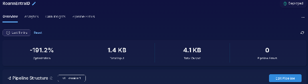

…and consequently in Event Search on AI SIEM searching XDR for   
**dataSource.name = ‘Azure\\ Active\\ Directory’** 

*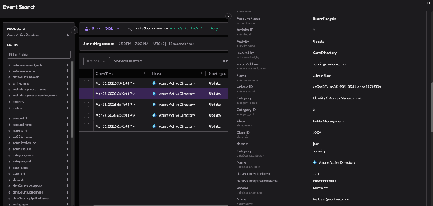*

### Ingesting MS Defender for Cloud Logs

This is a source that poses the same challenges as the previous, since it is configured similarly, but thank goodness they are only if you use API Genie. The challenge is that the source defined through the integration comes with a LUA script in the Advanced Settings. Let's give it a closer look.

Proceed as illustrated in the previous section to add a new Integration, then select **MS Defender for Cloud** as a source.

Choose a name and a description, then set the *Since Time* field as desired. Leave all other settings in *General Settings* unchanged.

Click on **Authentication**.

Set the *Application (Client) ID* and the *Client Secret* fields to **invented values** (of course in real life they would need to match the configuration in Entra ID).

Set the *Token URL* field to 	**https://apigenie-poc.roarinpenguin.com/my-roarin-tenant-id/oauth2/v2.0/token** and leave the rest of the fields unchanged.

Click on **Advanced Settings**.

Expand the Lua Script window by clicking on the  icon.

Locate the portion of the script that reads:

    local base_url

    if is_gcc_high then

        base_url = "https://graph.microsoft.us"

    else

        base_url = "https://graph.microsoft.com"

    end

And change the two URLs to 

    local base_url

    if is_gcc_high then

        base_url = "**https://apigenie-poc.roarinpenguin.com**"

    else

        base_url = "**https://apigenie-poc.roarinpenguin.com**"

    end

Click **Install.**

Congratulations! You have deployed your pipeline to integrate MS Entra ID logs:

Wait a couple of minutes for the log flow to start, then click on the **Last 1 Hour** button and set it to 5 minutes. You will see some traffic figures.

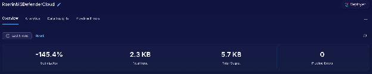

…and consequently in Event Search on AI SIEM searching XDR for   
**dataSource.name = ‘Microsoft Defender’** 

*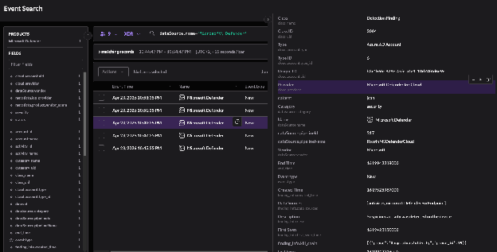*

Also, this pipeline has a glitch and it is not created with the Metadata Stamper.  
This is not blocking any demo, but in case you want to add it import it you will find the JSON here below:  
{  
    "transform":  
    {  
        "id": "300000000000000862",  
        "siteId": "912",  
        "templateId": "35",  
        "templateVersion": "1",  
        "name": "Transform Metadata Stamper",  
        "description": "",  
        "pipelineId": "0",  
        "config":  
        {  
            "config_groups":  
            [  
                {  
                    "_name": "General Configuration",  
                    "bypassed": false,  
                    "filterEnabled": false,  
                    "namespace": "dataSource"  
                },  
                {  
                    "_name": "MetadataStamper",  
                    "enabled": true,  
                    "namespace": "dataSource"  
                }  
            ]  
        },  
        "status": "NS_ACTIVE",  
        "created": "2026-04-22T09:58:24.101709Z",  
        "updated": "2026-04-22T09:58:24.101709Z",  
        "createdBy": "",  
        "updatedBy": "",  
        "isTransformGroup": false,  
        "origin": "NODE_ORIGIN_USER",  
        "templateName": "MetadataStamper",  
        "processorType": "DATA_PROCESSOR",  
        "siteFilenames":  
        [],  
        "userVisible": true  
    }  
}  
Position the transform between the OSCF Transform and the Destination as shown here below   
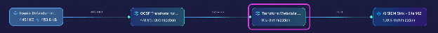

### Ingesting DarkTrace Logs

This is a source that looks fairly easy, but relevant for many customers. Let's examine it closer.

Add a new Integration and select **DarkTrace Event Ingestion**, give it a name and a description.

Set the *API Base URL* field to **https://apigenie-poc.roarinpenguin.com** and **set a date** for the field *Starting Date Time for collecting events*.

Click on **Authentication**.

Put **invented values** for the *Public Token* and the *Private Token* fields.

Click **Install**.

Congratulations! You have successfully built your ingestion pipeline for DarkTrace logs:

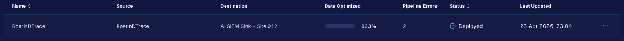

Wait a couple of minutes for the log flow to start, then click on the **Last 1 Hour** button and set it to 5 minutes. You will see some traffic figures.

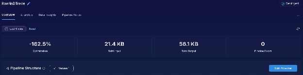

…and consequently in Event Search on AI SIEM searching XDR for   
**dataSource.name = ‘Darktrace’** 

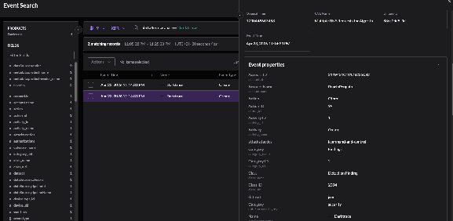

### Ingesting GCP Audit Logs

This is a complex source, based on the Pub/Sub logic.   
This section details how to configure it for your demos and testing.

Add a new Integration and select **GCP Audit Logs**, give it a name and a description.

Set the *Project* field to **obs-test**.

Click on **Authentication**.

Populate the *Subscription* field with the value **audit-logs-sub**

We have now to upload a valid Credential Path file. Proceed as follows.

1) Click on the upload icon in the field ()  
2) Download the credentials JSON file from the URL 	**https://apigenie-poc.roarinpenguin.com/admin/gcp-sa.json**.   
   If needed, authenticate as *admin* (see the chapter below for this purpose).  
3) In the upload window, set a meaningful filename (e.g. **gcp-creds.json**). If relevant, add a **Description** too.  
4) Select *File Type* **Secret**  
5) Click on **Upload** and select the file you just downloaded from API Genie.  
6) Click on **Save**.

Click on **Advanced Settings**

Populate the *Endpoint* field with the value **https://apigenie-poc.roarinpenguin.com:8443**

Click **Install**.

Congratulations! You have successfully built your ingestion pipeline for GCP Audit logs:

Wait a couple of minutes for the log flow to start, then click on the **Last 1 Hour** button and set it to 5 minutes. You will see some traffic figures.

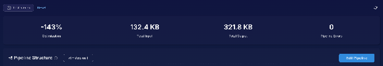

…and consequently in Event Search on AI SIEM searching XDR for   
**dataSource.name = ‘GCP Audit’** 

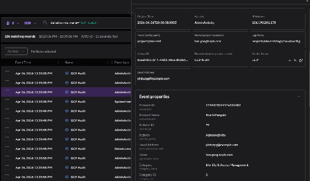

### Ingesting Tenable Vulnerability Management Audit Logs

This is a standard source, based on the X-ApiKeys authentication in HTTP header (accessKey + secretKey).   
This section details how to configure it for your demos and testing.

Add a new Integration and select **Tenable Vulnerability Management Logs**, give it a name and a description.

Set the *API Base URL* field to **https://apigenie-poc.roarinpenguin.com**.

Set the *Starting Date Time for collecting audit logs* field to the **date of choice**.

Click on **Authentication**.

Populate the *Tenable Access Key* field with the value **apigenie-ak-001**

Populate the *Tenable Secret Key* field with the value **apigenie-sk-001**

Click on **Install**.

Congratulations! You have successfully built your ingestion pipeline for Tenable Vulnerability Management logs:

Wait a couple of minutes for the log flow to start, then click on the **Last 1 Hour** button and set it to 5 minutes. You will see some traffic figures.

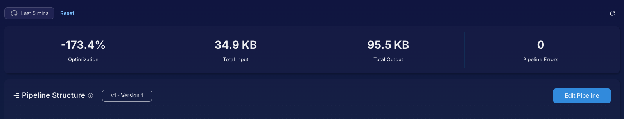

…and consequently in Event Search on AI SIEM searching XDR for   
**dataSource.name = ‘Tenable Vulnerability Management’** 

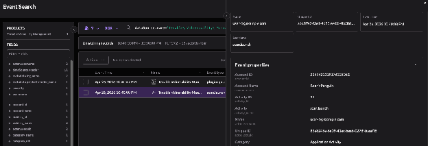

### Ingesting Snyk Logs

This is a very important source for CI/CD telemetry, based on a standard Bearer token authentication in HTTP header.   
This section details how to configure it for your demos and testing.

Add a new Integration and select **Snyk**, give it a name and a description.

Set the *API Base URL* field to **https://apigenie-poc.roarinpenguin.com**.

Set the *Entity Type* field to **Organization**.

Set the *Entity ID* field to an invented **value of choice**.

Set the *Starting Date Time for collecting issues* field to the **date of choice**.

Click on **Authentication**.

Populate the *Auth Token* field with the value **apigenie-valid-token-001**

Click on **Install**.

Congratulations! You have successfully built your ingestion pipeline for Snyk logs:

Wait a couple of minutes for the log flow to start, then click on the **Last 1 Hour** button and set it to 5 minutes. You will see some traffic figures.

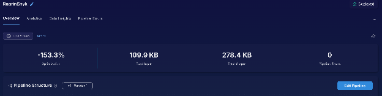

…and consequently in Event Search on AI SIEM searching XDR for   
**dataSource.name = ‘Snyk’** 

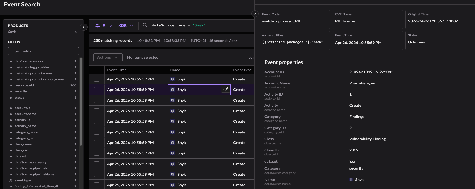

### Ingesting Azure Platform (Event Hub) Logs

This is a complex source, based on a proprietary kafka-like ingestion logic.   
This section details how to configure it for your demos and testing.

Add a new Integration and select **Azure Platform**, give it a name and a description.

Set the *Event Hubs Namespace Endpoint* field to [**apigenie-poc.roarinpenguin.com:9093**](http://apigenie-poc.roarinpenguin.com:9093).

Set the *Consumer Group* field to something meaningful of your choice. In real life this should match Azure Hub configuration, but API Genie will simply generate live the Consumer Group that you will craft. Just avoid using something too obvious, because if two different sources have the same Consumer Group - the first coming will consume all the… food :)

Add a field to *Event Hub Name* and give it a value of **azure-platform-logs**

Click on **SASL Authentication**.

Check that *SASL Enabled* is on.

Check that *SASL Mecanism* field is set to PLAIN.

Populate the *Connection String* field with the value   
**Endpoint=sb://apigenie-poc.roarinpenguin.com/;SharedAccessKeyName=mock;SharedAccessKey=apigenie-eh-mock-2026;EntityPath=azure-platform-logs**

Check that *SASL Username* field is set to **$$ConnectionString**.

Click on **Advanced Settings**.

Check that *Librdkafka Options* key *security.protocol* is set to **sasl_ssl**.

Set the field *Topic Key* to the value **topic**.

Set the field *Auto Offset Reset* to the value **earliest**.

Click **Install**.

Congratulations! You have successfully built your ingestion pipeline for Azure Platform logs:

Wait a couple of minutes for the log flow to start, then click on the **Last 1 Hour** button and set it to 5 minutes. You will see some traffic figures.

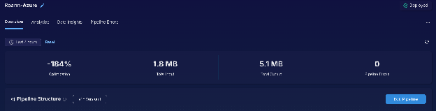

…and consequently in Event Search on AI SIEM searching XDR for   
**dataSource.name = ‘Azure Platform’** 

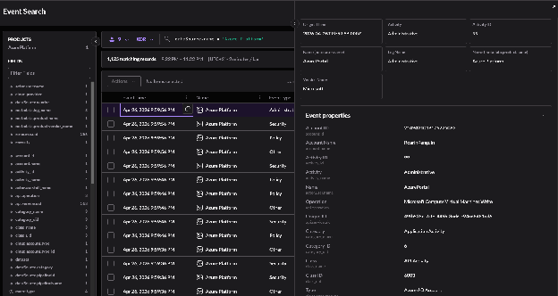

### Ingesting Microsoft 365 Logs

This is a source that poses some challenges, but thank goodness they are only if you use API Genie. The challenge is that the source defined through the integration comes with a LUA script in the Advanced Settings. Let's give it a closer look.

Proceed as illustrated in the previous section to add a new Integration, then select **Microsoft 365 Log Ingestion** as a source.

Choose a name and a description, then set the *Since Time* field as desired. 

Set the field *Microsoft Tenant ID* to a value of your choice, like **my-super-tenant**.

Leave all other settings in *General Settings* unchanged.

Click on **Log Type Selection**.

Select all the log types you are interested in.

Click on **Authentication**.

Set the *Application (Client) ID* and the *Client Secret* fields to **invented values** (of course in real life they would need to match the configuration in Entra ID).

Set the *Token URL* field to 	**https://apigenie-poc.roarinpenguin.com/\<the tenant ID that you specified above\>/oauth2/v2.0/token** and leave the rest of the fields unchanged.

Click on **Advanced Settings**.

Expand the Lua Script window by clicking on the  icon.

Locate the portion of the script that reads:

local is_gcc_high = config["IS_MICROSOFT_GCC_HIGH"]

local base_url = is_gcc_high == "true" and "**https://graph.microsoft.us**" or "**https://graph.microsoft.com**"

And change the two URLs to 

local is_gcc_high = config["IS_MICROSOFT_GCC_HIGH"]

local base_url = is_gcc_high == "true" and "**https://apigenie-poc.roarinpenguin.com**" or "**https://apigenie-poc.roarinpenguin.com**"

Click **Install.**

Congratulations! You have deployed your pipeline to integrate MS Entra ID logs:

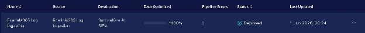

Wait a couple of minutes for the log flow to start, then click on the **Last 1 Hour** button and set it to 5 minutes. You will see some traffic figures.

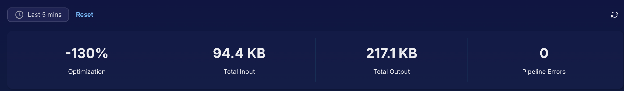

…and consequently in Event Search on AI SIEM searching XDR for   
**dataSource.name = ‘Microsoft O365’** 

*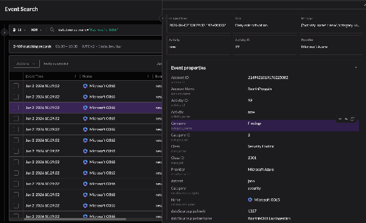*

### Using a Custom Listener as a Source

The integrations covered above work because API Genie already knows how to impersonate those specific platforms. But what if you need to demo or validate a custom Lua source — one targeting a platform that isn't on that list, or an internal API specific to your customer's environment?

That's what **Custom Listeners** are for. Instead of a fixed integration, you create an HTTP endpoint on the fly: you decide the URL path, the auth method, the response format and the data behind it. Your SCol Lua source polls it just like a real API — because as far as the collector is concerned, it is one.

Feed it with synthetic telemetry across four topics (endpoint / identity / cloud / network), or upload a real log file and have API Genie replay it with timestamps shifted to now — ready for the collector to consume without any script changes.

Full configuration walkthrough in **Listeners Tab** in the Admin section below.

### Log Push

The ability to push log streams to different destinations landed in API Genie later, since this use case was already satisfied by other systems like Helios and Pyxis. 

The idea behind offering a similar capability here is justified by the possibility to share some system primitives like log profiles customization and detection rules matching.

The Log Push section allows you to define log stream for a defined interval of time (no unlimited streaming supported as of now) to three types of destinations:

- Syslog listener  
- HTTP Push listener  
- HEC (HTTP Event Collector) - this one supporting Observo/DPM, SentinelOne AI SIEM and Splunk variants 

To proceed with configuring a log push source, click on the **New Push Profile** button.

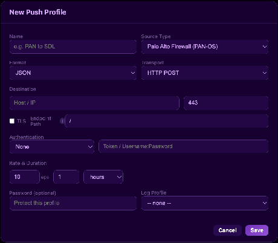

Here you can choose your source type among the following supported ones:

Palo Alto Firewall (PAN-OS)

Fortinet FortiGate

Check Point NGFW

Cisco ASA/FTD

Crowdstrike Falcon (EDR)

Carbon Black Cloud (EDR)

Zscaler Internet Access (ZIA)

Imperva Cloud WAF

Barracuda Email Security Gateway

Infoblox DDI (DNS/DHCP)

Cisco Switch (IOS/NX-OS)

HPE Aruba Switch (AOS-CX)

SentinelOne Singularity (XDR)

Corelight / Zeek NDR

CyberArk EPM / PAM

Stamus Network SSP (Suricata)

You can as well decide which **format** you want your logs in: *JSON, Syslog (RFC5424), or CEF*. Bear in mind that this setting affects the format of the log strings, not the way the logs are transmitted.

The **transport** can be *SYSLOG (TCP or UDP), HTTP POST,* or *HEC*.

Depending on the transport type, the options to be configured will change slightly.

Then you can set the **Rate** and **Duration**. This will allow you to decide the intensity and length of transmission. To avoid overloading the system, unlimited transmission is not supported as of now.

Finally, you can bind a specific log profile - and protect your transmission profile with a password.

To start streaming select **start** when the profile appears in the list.

You can see what events are generated by selecting **Events** 

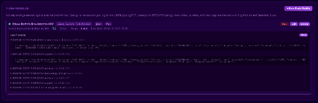

---

## Thank you

The maintainer of API Genie is **RoarinPenguin**. Reach out at [roarinpenguin@sentinelone.com](mailto:roarinpenguin@sentinelone.com) with feedback, corrections, and ideas.

For deployment and deeper reference, see the **README.md** and the **docs/** folder at
[https://github.com/roarinpenguin/apigenie](https://github.com/roarinpenguin/apigenie).

*Crafted with 💜 by the RoarinPenguin*

