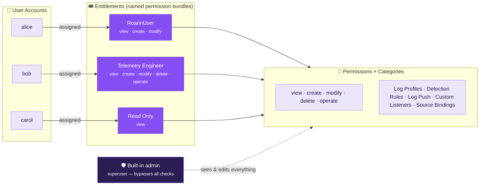
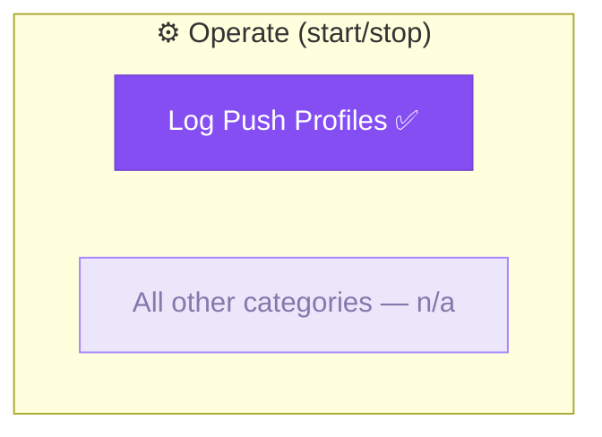
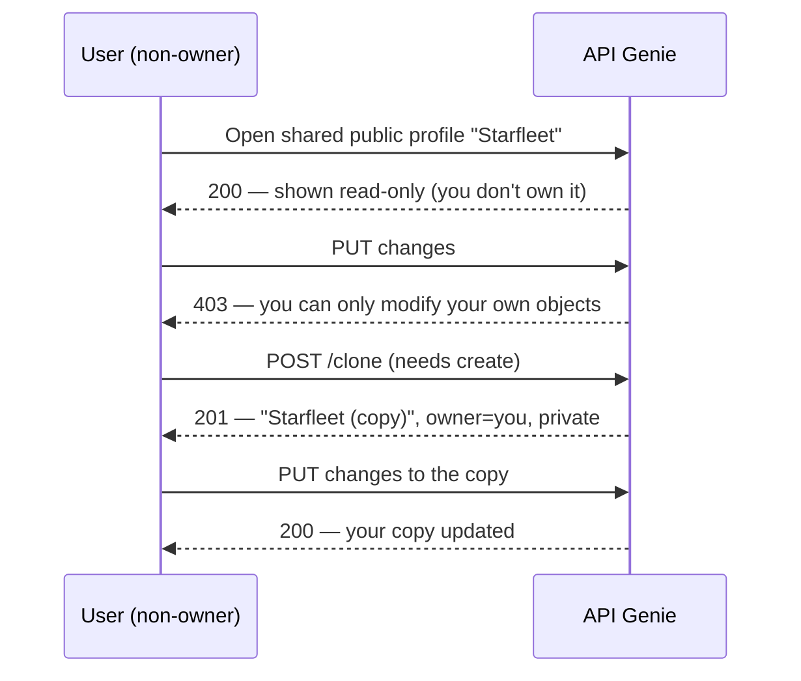

<!--
  API Genie — RBAC reference. The Mermaid diagrams render natively on GitHub and
  in most Markdown previewers. Brand palette mirrors the landing page:
  #854EF3 / #7947D7 / #A986FD on the neumorphic lilac surface #ece6fa.
-->

# API Genie — Role-Based Access Control (RBAC)

How **permissions** are bundled into **entitlements**, how entitlements are **assigned to user accounts**, and how **object ownership** decides who can change what.

> **TL;DR** — A *user account* is assigned exactly one *entitlement*. An *entitlement* is a named bundle of *permissions* granted per *resource category*. On top of that, every object you create is *owned* by you and is either *private* or *public*; you can always read public objects, but you can only change your own. The built-in **admin** is a superuser that bypasses all of this.

---

## 1. The big picture



**Three independent layers decide every action:**

1. **Authentication** — who you are (a registered account, or the built-in admin).
2. **Authorization (entitlement)** — *what kind of action* you may take in a category (`create`, `modify`, …).
3. **Ownership & visibility** — *which specific objects* you may read or change.

All three must agree. The entitlement says "you may modify Log Profiles"; ownership says "…but only the ones you own."

---

## 2. Permissions

Five permission levels exist. They are stored per category inside an entitlement.

| Permission | Label in UI | Grants |
|-----------|-------------|--------|
| `view`   | **View**    | See objects in this category (your own **+** public shared). |
| `create` | **Create**  | Create new objects, **and clone** existing ones into your own copies. |
| `modify` | **Modify**  | Edit objects **you own** in this category. |
| `delete` | **Delete**  | Delete objects **you own** in this category. |
| `manage` | **Operate** | Run/operate objects — **start & stop log-push generation** (Log Push only). |

> **Naming note** — the **Operate** permission is stored internally as `manage` for backward-compatibility with entitlements already saved in the database. Only the user-facing label changed; no migration is required.

---

## 3. Resource categories

Permissions are granted **per category**:

| Category | Key | What it controls |
|----------|-----|------------------|
| **Log Profiles** | `log_profiles` | Entity pools (users, machines, C2, malware, mail senders) bound to sources. |
| **Detection Rules** | `detection_rules` | Periodic SIEM-trigger rules with field overrides. |
| **Log Push Profiles** | `log_push` | Outbound push jobs (HTTP/HEC/syslog) — **the only category that uses Operate**. |
| **Custom Listeners** | `listeners` | User-defined mock HTTP endpoints (synthetic or replay). |
| **Source Bindings** | `source_bindings` | Source ↔ profile bindings and per-source volume/intensity. |

### Which permissions apply where



`view` / `create` / `modify` / `delete` are meaningful for **every** category. **Operate** is only consumed by **Log Push** (the *Start* / *Stop* buttons). Granting Operate elsewhere has no effect.

---

## 4. Ownership & visibility (per-object isolation)

Entitlements decide *what kind* of action you can take; **ownership** decides *which objects*.

Every user-customizable object (log profile, detection rule, push profile, custom listener) carries:

- **`owner_id`** — the account that created it.
- **`visibility`** — `private` (only you + admin) or `public` (everyone can read).

```mermaid
flowchart TD
    A["Request to read/modify object X"] --> B{Am I admin?}
    B -- yes --> ALLOW["✅ Allowed (superuser)"]
    B -- no --> C{Read or write?}
    C -- read --> D{X.visibility == public<br/>OR I own X?}
    D -- yes --> ALLOW
    D -- no --> DENY["⛔ 403 / hidden"]
    C -- write --> E{Do I own X?<br/>(X.owner_id == me)}
    E -- yes --> F{Entitlement grants<br/>modify/delete/operate?}
    F -- yes --> ALLOW
    F -- no --> DENY
    E -- no --> CLONE["🔁 Read-only — use Clone to get<br/>your own editable copy"]

    classDef ok fill:#854EF3,stroke:#7947D7,color:#fff;
    classDef bad fill:#2a1d52,stroke:#A986FD,color:#fff;
    class ALLOW,CLONE ok;
    class DENY bad;
```

**Legacy objects** created before ownership existed (no `owner_id`/`visibility`) are treated as **admin-owned & public** — everyone can read them, only admin can edit them.

### The Clone model (Hybrid)

Because you can **see** public objects you don't own but can't edit them, every editor offers a **Clone** action (requires `create`). Cloning copies the object into a **new, private object you own**, named `… (copy)`, which you can then edit freely.



---

## 5. How the API enforces it

Write requests (`POST`/`PUT`/`PATCH`/`DELETE`) are gated server-side before the endpoint runs. `GET` is never permission-gated (visibility handles read access). The mapping:

| Action | Endpoint (example) | Category | Permission required |
|--------|--------------------|----------|---------------------|
| Create | `POST /admin/api/profiles` | `log_profiles` | `create` |
| Clone  | `POST /admin/api/profiles/{id}/clone` | `log_profiles` | `create` |
| Modify | `PUT/PATCH /admin/api/profiles/{id}` | `log_profiles` | `modify` |
| Delete | `DELETE /admin/api/profiles/{id}` | `log_profiles` | `delete` |
| Create/Clone | `…/detection-rules…` | `detection_rules` | `create` |
| Modify / Delete | `…/detection-rules/{id}` | `detection_rules` | `modify` / `delete` |
| Create/Clone | `…/push/profiles…` | `log_push` | `create` |
| Modify / Delete | `…/push/profiles/{id}` | `log_push` | `modify` / `delete` |
| **Start / Stop** | `…/push/profiles/{id}/start\|stop` | `log_push` | **`operate`** or `modify` |
| Create/Clone | `…/listeners…` | `listeners` | `create` |
| Modify / Delete | `…/listeners/{id}` | `listeners` | `modify` / `delete` |
| Bind / Unbind | `…/source-profiles/{source}` | `source_bindings` | `create`+`modify` / `delete`+`modify` |

> Two gates apply to writes: **(a)** the entitlement permission above, **and (b)** ownership of the specific object. Admin bypasses both. A valid session that lacks the permission gets **403**; an invalid/expired session gets **401**.

---

## 6. Worked example

**Entitlement `RoarinUser`** = `view · create · modify` on all categories (no `delete`, no `operate`).
User **alice** is assigned it.

| alice tries to… | Result | Why |
|-----------------|--------|-----|
| View the public `Starfleet` profile (admin-owned) | ✅ 200, read-only | `view` + public visibility |
| Save edits to `Starfleet` | ⛔ 403 | she doesn't own it → editor shows **Clone** instead |
| Clone `Starfleet` | ✅ 201 → `Starfleet (copy)`, private, owned by alice | `create` |
| Edit her clone | ✅ 200 | `modify` + she owns it |
| Delete her clone | ⛔ 403 | entitlement has no `delete` |
| Start a push profile | ⛔ 403 | entitlement has no `operate` |

---

## 7. Administering RBAC

In the **Admin** portal → *RBAC* card:

1. **Create an entitlement** — tick the permission boxes per category (hover a column header for what each permission grants).
2. **Create / edit a user account** and assign the entitlement.
3. Users sign into the **User Portal** (`/portal/login`); the UI hides controls their entitlement can't use, and editors switch to read-only with a **Clone** button for objects they don't own.

The built-in **admin** account always has every permission in every category and owns/edits all objects.

---

*Source of truth:* permission/category definitions live in [`accounts.py`](../accounts.py) (`Perm`, `Category`, `PERM_LABELS`, `PERM_DESCRIPTIONS`); enforcement lives in [`admin.py`](../admin.py) (`_perm_requirement`, `permission_error`, `_can_write_obj`, `_can_see_obj`).
